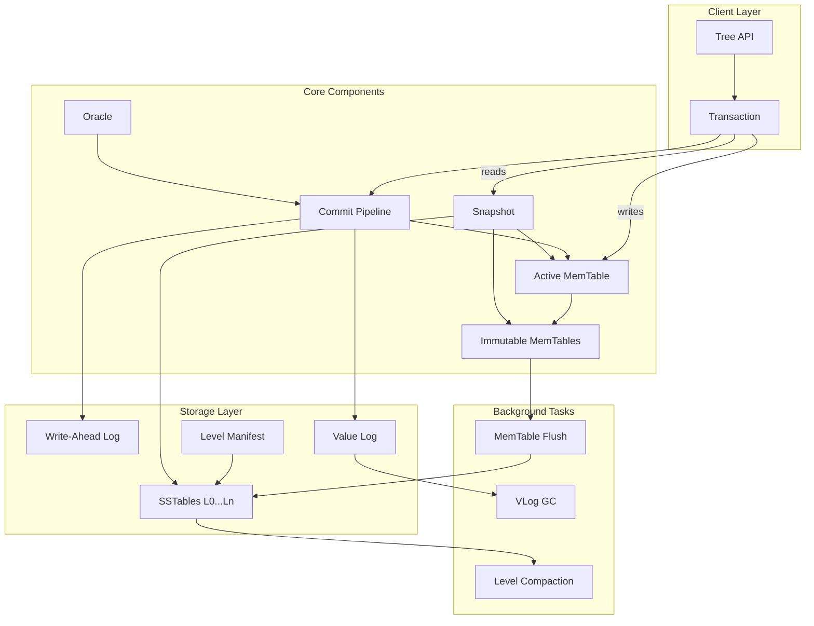
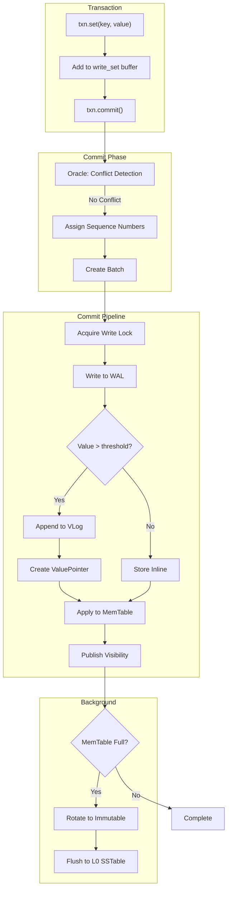
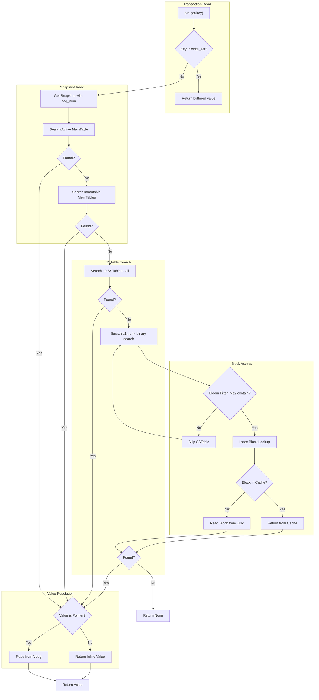
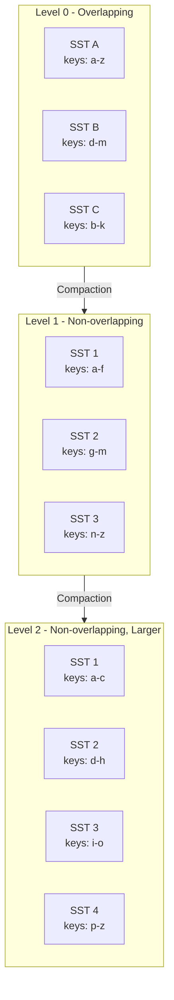
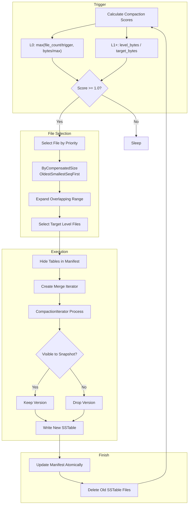
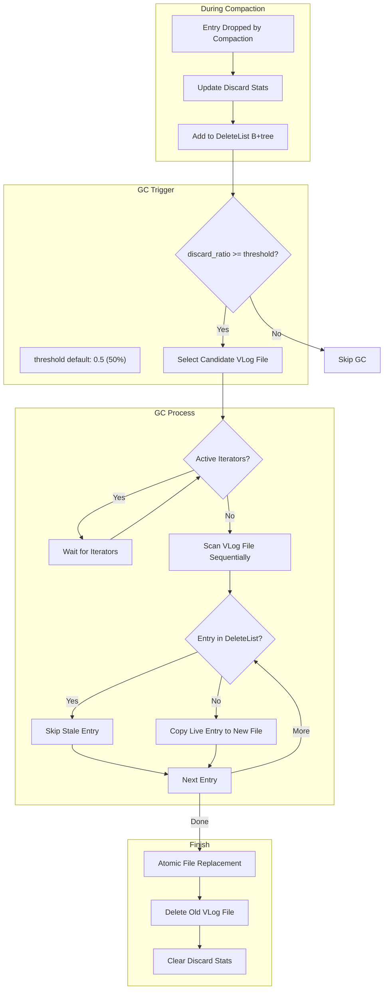
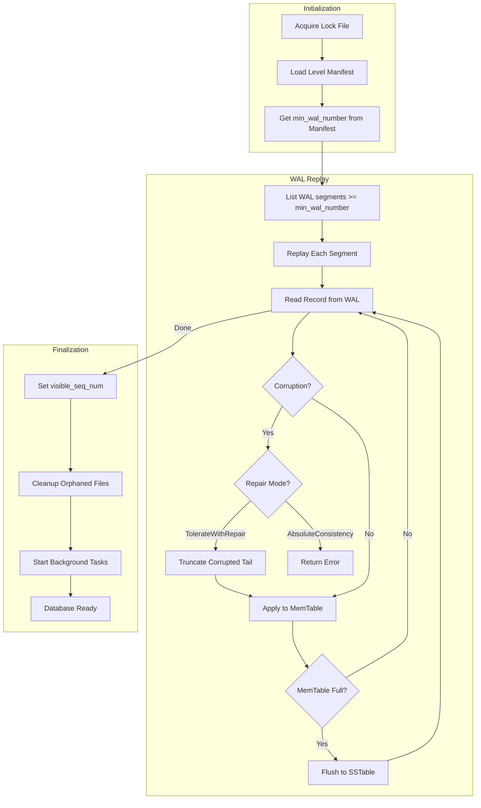
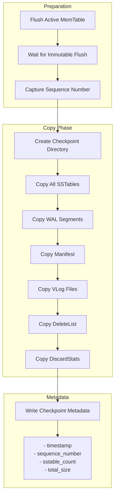

# SurrealKV Architecture

SurrealKV is a versioned, embedded key-value database built on an LSM (Log-Structured Merge) tree architecture. This document provides a comprehensive overview of the internal design, data flow, and key subsystems.

## Table of Contents

1. [Overall Architecture](#overall-architecture)
2. [Write Path](#write-path)
3. [Read Path](#read-path)
4. [Versioning and MVCC](#versioning-and-mvcc)
5. [Compaction](#compaction)
6. [Value Log (VLog)](#value-log-vlog)
7. [VLog Garbage Collection](#vlog-garbage-collection)
8. [Recovery](#recovery)
9. [Checkpoint and Restore](#checkpoint-and-restore)

---

## Overall Architecture

SurrealKV is organized into four main layers: the Client API, Core Components, Storage Layer, and Background Tasks.

### Mermaid Diagram



### ASCII Diagram

```
┌─────────────────────────────────────────────────────────────────────────────┐
│                              CLIENT LAYER                                    │
│  ┌─────────────┐      ┌─────────────────────────────────────────────────┐   │
│  │    Tree     │──────│                  Transaction                    │   │
│  │    API      │      │  ┌─────────┐  ┌─────────┐  ┌─────────────────┐  │   │
│  └─────────────┘      │  │write_set│  │ get()   │  │ commit()        │  │   │
│                       │  │ buffer  │  │ set()   │  │ rollback()      │  │   │
│                       │  └─────────┘  └─────────┘  └─────────────────┘  │   │
│                       └─────────────────────────────────────────────────┘   │
└─────────────────────────────────────────────────────────────────────────────┘
                                       │
                                       ▼
┌─────────────────────────────────────────────────────────────────────────────┐
│                              CORE COMPONENTS                                 │
│  ┌──────────────┐  ┌──────────────┐  ┌──────────────┐  ┌──────────────┐    │
│  │   Oracle     │  │   Commit     │  │   Active     │  │  Immutable   │    │
│  │  (conflict   │  │   Pipeline   │  │  MemTable    │  │  MemTables   │    │
│  │  detection)  │  │ (lock-free)  │  │  (skiplist)  │  │   (queue)    │    │
│  └──────────────┘  └──────────────┘  └──────────────┘  └──────────────┘    │
│         │                 │                 │                 │             │
│         └────────────────┼─────────────────┼─────────────────┘             │
│                          ▼                 ▼                                │
│                    ┌──────────────────────────────────────┐                 │
│                    │           Snapshot                   │                 │
│                    │   (point-in-time consistent view)    │                 │
│                    └──────────────────────────────────────┘                 │
└─────────────────────────────────────────────────────────────────────────────┘
                                       │
                                       ▼
┌─────────────────────────────────────────────────────────────────────────────┐
│                              STORAGE LAYER                                   │
│  ┌──────────────┐  ┌──────────────┐  ┌──────────────┐  ┌──────────────┐    │
│  │     WAL      │  │   SSTables   │  │  Value Log   │  │   Manifest   │    │
│  │  (durability)│  │   (L0..Ln)   │  │  (WiscKey)   │  │   (levels)   │    │
│  │  32KB blocks │  │  sorted runs │  │ large values │  │  table meta  │    │
│  └──────────────┘  └──────────────┘  └──────────────┘  └──────────────┘    │
└─────────────────────────────────────────────────────────────────────────────┘
                                       │
                                       ▼
┌─────────────────────────────────────────────────────────────────────────────┐
│                            BACKGROUND TASKS                                  │
│  ┌──────────────────┐  ┌──────────────────┐  ┌──────────────────┐          │
│  │  MemTable Flush  │  │  Level Compaction │  │   VLog GC       │          │
│  │  (imm -> L0)     │  │  (merge SSTables) │  │  (reclaim space)│          │
│  └──────────────────┘  └──────────────────┘  └──────────────────┘          │
└─────────────────────────────────────────────────────────────────────────────┘
```

### Component Overview

| Component | Purpose | Key Files |
|-----------|---------|-----------|
| **Tree** | Public API for database operations | `src/lsm.rs` |
| **Transaction** | ACID transaction with MVCC | `src/transaction.rs` |
| **Oracle** | Transaction timestamp and conflict detection | `src/oracle.rs` |
| **CommitPipeline** | Lock-free commit queue (inspired by Pebble) | `src/commit.rs` |
| **MemTable** | In-memory skip list for recent writes | `src/memtable/` |
| **Snapshot** | Point-in-time consistent view | `src/snapshot.rs` |
| **WAL** | Write-ahead log for durability | `src/wal/` |
| **SSTable** | Sorted string table on disk | `src/sstable/` |
| **VLog** | Value log for large value separation | `src/vlog.rs` |
| **Manifest** | Level metadata and SSTable tracking | `src/levels/` |

### Directory Structure

```
database_path/
├── wal/                    # Write-ahead log segments
│   ├── 00000000000000000001.wal
│   └── 00000000000000000002.wal
├── sstables/               # SSTable files
│   ├── 00000000000000000001.sst
│   └── 00000000000000000002.sst
├── manifest/               # Level manifest files
│   └── 00000000000000000001.manifest
├── vlog/                   # Value log files (if enabled)
│   ├── 00000000000000000001.vlog
│   └── 00000000000000000002.vlog
├── discard_stats/          # VLog discard statistics
├── delete_list/            # VLog delete tracking (B+tree)
├── versioned_index/        # B+tree index (if enabled)
└── LOCK                    # Lock file
```

---

## Write Path

The write path describes how data flows from a transaction's `set()` call through to durable storage.

### Mermaid Diagram



### ASCII Diagram

```
┌─────────────────────────────────────────────────────────────────────────────┐
│                           TRANSACTION PHASE                                  │
│                                                                              │
│  txn.set(key, value)  ──►  Buffer in write_set  ──►  txn.commit()           │
│                            (BTreeMap)                                        │
└─────────────────────────────────────────────────────────────────────────────┘
                                       │
                                       ▼
┌─────────────────────────────────────────────────────────────────────────────┐
│                            COMMIT PHASE                                      │
│                                                                              │
│  ┌─────────────────┐    ┌─────────────────┐    ┌─────────────────┐         │
│  │     Oracle      │───►│  Assign SeqNum  │───►│  Create Batch   │         │
│  │ (conflict check)│    │  (atomic inc)   │    │  (entries)      │         │
│  └─────────────────┘    └─────────────────┘    └─────────────────┘         │
└─────────────────────────────────────────────────────────────────────────────┘
                                       │
                                       ▼
┌─────────────────────────────────────────────────────────────────────────────┐
│                         COMMIT PIPELINE (Serialized)                         │
│                                                                              │
│  ┌─────────────────┐    ┌─────────────────┐                                 │
│  │ Acquire Write   │───►│   Write to WAL  │                                 │
│  │     Mutex       │    │  (durability)   │                                 │
│  └─────────────────┘    └─────────────────┘                                 │
│                                  │                                           │
│                                  ▼                                           │
│                    ┌─────────────────────────────┐                          │
│                    │  Value Size > Threshold?    │                          │
│                    └─────────────────────────────┘                          │
│                         │                  │                                 │
│                    Yes  ▼                  ▼  No                            │
│            ┌─────────────────┐    ┌─────────────────┐                       │
│            │ Append to VLog  │    │  Store Inline   │                       │
│            │ Create Pointer  │    │  (in SSTable)   │                       │
│            └─────────────────┘    └─────────────────┘                       │
│                         │                  │                                 │
│                         └────────┬─────────┘                                │
│                                  ▼                                           │
│                    ┌─────────────────────────────┐                          │
│                    │   Apply to Active MemTable  │                          │
│                    │       (skip list insert)    │                          │
│                    └─────────────────────────────┘                          │
│                                  │                                           │
│                                  ▼                                           │
│                    ┌─────────────────────────────┐                          │
│                    │  Publish Visibility         │                          │
│                    │  (update visible_seq_num)   │                          │
│                    └─────────────────────────────┘                          │
└─────────────────────────────────────────────────────────────────────────────┘
                                       │
                                       ▼
┌─────────────────────────────────────────────────────────────────────────────┐
│                          BACKGROUND TASKS                                    │
│                                                                              │
│  ┌─────────────────────────┐    ┌─────────────────────────────────────┐    │
│  │  MemTable Full?         │───►│  Rotate: Active → Immutable Queue   │    │
│  │  (size > threshold)     │Yes │  Create new empty Active MemTable   │    │
│  └─────────────────────────┘    └─────────────────────────────────────┘    │
│                                              │                              │
│                                              ▼                              │
│                              ┌─────────────────────────────────────┐        │
│                              │  Flush Immutable to L0 SSTable      │        │
│                              │  (background task, async)           │        │
│                              └─────────────────────────────────────┘        │
└─────────────────────────────────────────────────────────────────────────────┘
```

### Key Implementation Details

1. **Transaction Buffering**: All writes within a transaction are buffered in a `BTreeMap<Key, Vec<Entry>>` called `write_set`. This enables:
   - Read-your-own-writes (RYOW) semantics
   - Savepoint/rollback support
   - Atomic commit

2. **Commit Pipeline**: Inspired by Pebble's design, the commit pipeline uses a lock-free queue with a serialized WAL write phase:
   - Single producer (WAL write is serialized via mutex)
   - Multi-consumer (memtable apply and publish can be concurrent)
   - Flow control via semaphore (max 8 concurrent commits)

3. **Value Separation**: When VLog is enabled:
   - Values larger than `vlog_value_threshold` (default: 1KB) go to VLog
   - A 25-byte `ValuePointer` is stored in the SSTable instead
   - Small values are stored inline for efficiency

4. **Durability Modes**:
   - `Eventual` (default): Data written to OS buffer, fast
   - `Immediate`: fsync on commit, guarantees durability

5. **Sequence Numbers**: Each entry gets a monotonically increasing sequence number used for:
   - MVCC visibility
   - Snapshot isolation
   - Compaction ordering

---

## Read Path

The read path describes how data is retrieved from a transaction's `get()` call, traversing all storage layers.

### Mermaid Diagram



### ASCII Diagram

```
┌─────────────────────────────────────────────────────────────────────────────┐
│                           TRANSACTION READ                                   │
│                                                                              │
│  txn.get(key)  ──►  Check write_set (RYOW)  ──►  Found? Return immediately  │
│                            │                                                 │
│                            ▼ Not in write_set                               │
└─────────────────────────────────────────────────────────────────────────────┘
                                       │
                                       ▼
┌─────────────────────────────────────────────────────────────────────────────┐
│                           SNAPSHOT READ                                      │
│                                                                              │
│  Create Snapshot (seq_num = visible_seq_num at txn start)                   │
│                            │                                                 │
│                            ▼                                                 │
│  ┌──────────────────────────────────────────────────────────────────────┐   │
│  │ Search Order (stop on first match with seq_num <= snapshot.seq_num): │   │
│  │                                                                       │   │
│  │   1. Active MemTable (newest writes, in-memory skiplist)             │   │
│  │              │                                                        │   │
│  │              ▼                                                        │   │
│  │   2. Immutable MemTables (newest first, pending flush)               │   │
│  │              │                                                        │   │
│  │              ▼                                                        │   │
│  │   3. Level 0 SSTables (ALL tables, may overlap)                      │   │
│  │              │                                                        │   │
│  │              ▼                                                        │   │
│  │   4. Level 1...N SSTables (binary search, non-overlapping)           │   │
│  └──────────────────────────────────────────────────────────────────────┘   │
└─────────────────────────────────────────────────────────────────────────────┘
                                       │
                                       ▼
┌─────────────────────────────────────────────────────────────────────────────┐
│                         SSTABLE LOOKUP DETAIL                                │
│                                                                              │
│  For each SSTable candidate:                                                │
│                                                                              │
│  ┌─────────────────┐    ┌─────────────────┐    ┌─────────────────┐         │
│  │  Bloom Filter   │───►│  Index Block    │───►│  Data Block     │         │
│  │  (may_contain?) │ Yes│  (binary search)│    │  (with cache)   │         │
│  └─────────────────┘    └─────────────────┘    └─────────────────┘         │
│         │ No                                                                 │
│         ▼                                                                    │
│    Skip to next SSTable                                                     │
└─────────────────────────────────────────────────────────────────────────────┘
                                       │
                                       ▼
┌─────────────────────────────────────────────────────────────────────────────┐
│                         VALUE RESOLUTION                                     │
│                                                                              │
│                    ┌─────────────────────────────┐                          │
│                    │  Is ValueLocation a Pointer? │                          │
│                    └─────────────────────────────┘                          │
│                         │                  │                                 │
│                    Yes  ▼                  ▼  No                            │
│            ┌─────────────────┐    ┌─────────────────┐                       │
│            │  Read from VLog │    │ Return Inline   │                       │
│            │  (file_id,offset)│   │    Value        │                       │
│            └─────────────────┘    └─────────────────┘                       │
│                         │                  │                                 │
│                         └────────┬─────────┘                                │
│                                  ▼                                           │
│                         Return Value to Caller                              │
└─────────────────────────────────────────────────────────────────────────────┘
```

### Key Implementation Details

1. **RYOW (Read Your Own Writes)**: Before checking storage, the transaction first looks in its local `write_set` buffer. This ensures uncommitted writes are visible to subsequent reads within the same transaction.

2. **Snapshot Isolation**: Each read transaction gets a snapshot with a fixed `seq_num`. Only entries with `seq_num <= snapshot.seq_num` are visible, providing consistent point-in-time reads.

3. **Level 0 vs Level 1+**:
   - **L0**: SSTables may have overlapping key ranges (recently flushed), so ALL must be searched
   - **L1+**: SSTables have non-overlapping key ranges, enabling binary search for the right table

4. **Bloom Filters**: Each SSTable has a Bloom filter that quickly eliminates tables that definitely don't contain a key, avoiding unnecessary disk reads.

5. **Block Cache**: Data blocks are cached in an LRU cache to avoid repeated disk reads. The cache key is `(file_id, block_offset)`.

6. **VLog Resolution**: If the stored value is a `ValuePointer` (indicated by metadata bit), the actual value is fetched from the VLog file at the specified offset.

---

## Versioning and MVCC

SurrealKV implements Multi-Version Concurrency Control (MVCC) with snapshot isolation for concurrent reads and writes.

### InternalKey Structure

Every key stored in SurrealKV is an `InternalKey` with the following encoding:

```
┌──────────────────┬───────────────────┬──────────────────┐
│    user_key      │    trailer (8B)   │  timestamp (8B)  │
│   (variable)     │  seq_num | kind   │   nanoseconds    │
└──────────────────┴───────────────────┴──────────────────┘

trailer = (seq_num << 8) | kind

kind values:
  0 = Delete (hard delete, tombstone)
  1 = SoftDelete (versioned delete)
  2 = Set (normal write)
  6 = Replace (replaces all previous versions)
```

### Snapshot Isolation

```
Timeline:
─────────────────────────────────────────────────────────────►
     │           │           │           │
  seq=1       seq=2       seq=3       seq=4
  Set(A,1)    Set(A,2)    Set(A,3)    Delete(A)
     │           │           │           │
     │           │           │           │
     ▼           ▼           ▼           ▼
┌─────────────────────────────────────────────────────────┐
│ Snapshot at seq=2 sees: A=2                             │
│ Snapshot at seq=3 sees: A=3                             │
│ Snapshot at seq=4 sees: A deleted (tombstone)           │
└─────────────────────────────────────────────────────────┘
```

### Version Retention

When versioning is enabled (`with_versioning(true, retention_ns)`):
- All versions are preserved (not just the latest)
- Versions older than `retention_ns` may be garbage collected during compaction
- `retention_ns = 0` means no retention limit (keep all versions forever)

---

## Compaction

Compaction merges SSTables to reduce read amplification and reclaim space from obsolete versions.

### LSM Tree Structure



### ASCII LSM Structure

```
┌─────────────────────────────────────────────────────────────────────────────┐
│                         LSM TREE STRUCTURE                                   │
├─────────────────────────────────────────────────────────────────────────────┤
│                                                                              │
│  LEVEL 0 (Overlapping - recently flushed memtables)                         │
│  ┌─────────┐ ┌─────────┐ ┌─────────┐                                        │
│  │ SST A   │ │ SST B   │ │ SST C   │  ← May have overlapping key ranges    │
│  │ a───z   │ │ d───m   │ │ b───k   │                                        │
│  └─────────┘ └─────────┘ └─────────┘                                        │
│       │           │           │                                              │
│       └───────────┼───────────┘                                              │
│                   ▼                                                          │
│  LEVEL 1 (Non-overlapping, sorted)                                          │
│  ┌─────────┬─────────┬─────────┐                                            │
│  │ SST 1   │ SST 2   │ SST 3   │  ← Non-overlapping, can binary search     │
│  │ a───f   │ g───m   │ n───z   │                                            │
│  └─────────┴─────────┴─────────┘                                            │
│                   │                                                          │
│                   ▼                                                          │
│  LEVEL 2 (Non-overlapping, 10x larger)                                      │
│  ┌──────┬──────┬──────┬──────┐                                              │
│  │SST 1 │SST 2 │SST 3 │SST 4 │                                              │
│  │ a─c  │ d─h  │ i─o  │ p─z  │                                              │
│  └──────┴──────┴──────┴──────┘                                              │
│                   │                                                          │
│                   ▼                                                          │
│  LEVEL N (Bottom level)                                                     │
│                                                                              │
└─────────────────────────────────────────────────────────────────────────────┘
```

### Compaction Flowchart



### ASCII Compaction Flow

```
┌─────────────────────────────────────────────────────────────────────────────┐
│                         COMPACTION TRIGGER                                   │
│                                                                              │
│  Calculate scores for each level:                                           │
│    L0 score = max(file_count / 4, total_bytes / max_bytes)                  │
│    Ln score = level_bytes / target_bytes_for_level                          │
│                                                                              │
│  Pick level with highest score >= 1.0                                       │
└─────────────────────────────────────────────────────────────────────────────┘
                                       │
                                       ▼
┌─────────────────────────────────────────────────────────────────────────────┐
│                          FILE SELECTION                                      │
│                                                                              │
│  1. Select file by priority:                                                │
│     - ByCompensatedSize: file_size * (1 + delete_ratio * 0.5)              │
│     - OldestSmallestSeqFirst: oldest sequence number                        │
│                                                                              │
│  2. Expand to include all files sharing boundary keys                       │
│                                                                              │
│  3. Select overlapping files from target level                              │
└─────────────────────────────────────────────────────────────────────────────┘
                                       │
                                       ▼
┌─────────────────────────────────────────────────────────────────────────────┐
│                      COMPACTION ITERATOR                                     │
│                                                                              │
│  For each key in merged iterator:                                           │
│                                                                              │
│  ┌───────────────────────────────────────────────────────────────────────┐  │
│  │                   SNAPSHOT-AWARE DECISION                              │  │
│  │                                                                        │  │
│  │  1. Find earliest snapshot that can see this version                  │  │
│  │                                                                        │  │
│  │  2. If same visibility boundary as newer version → DROP (superseded)  │  │
│  │                                                                        │  │
│  │  3. If visible to any active snapshot → KEEP                          │  │
│  │                                                                        │  │
│  │  4. If versioning enabled and within retention → KEEP                 │  │
│  │                                                                        │  │
│  │  5. Tombstone at bottom level with no snapshots → DROP                │  │
│  │                                                                        │  │
│  │  6. Otherwise → DROP                                                   │  │
│  └───────────────────────────────────────────────────────────────────────┘  │
│                                                                              │
│  Track VLog discard stats for garbage collection                            │
└─────────────────────────────────────────────────────────────────────────────┘
                                       │
                                       ▼
┌─────────────────────────────────────────────────────────────────────────────┐
│                           FINISH                                             │
│                                                                              │
│  1. Write new SSTable to disk                                               │
│  2. Update manifest atomically (add new, remove old)                        │
│  3. Delete old SSTable files                                                │
│  4. Flush VLog discard stats                                                │
└─────────────────────────────────────────────────────────────────────────────┘
```

### Snapshot-Aware Compaction

The compaction iterator preserves versions that are visible to active snapshots:

```
Active Snapshots: [seq=5, seq=10, seq=15]

Key: "foo"
  Version seq=12 → Visible to snapshot seq=15 → KEEP
  Version seq=8  → Visible to snapshot seq=10 → KEEP  
  Version seq=6  → Visible to snapshot seq=10 (hidden by seq=8 in same boundary) → DROP
  Version seq=3  → Visible to snapshot seq=5  → KEEP
  Version seq=1  → Not visible to any snapshot → DROP (unless retention enabled)
```

---

## Value Log (VLog)

SurrealKV implements WiscKey-style value separation to reduce write amplification for large values.

### Value Separation Decision

```
┌─────────────────────────────────────────────────────────────────────────────┐
│                      VALUE SEPARATION DECISION                               │
│                                                                              │
│  During commit, for each value:                                             │
│                                                                              │
│                    ┌─────────────────────────────┐                          │
│                    │  value.len() > threshold?   │                          │
│                    │  (default: 1KB)             │                          │
│                    └─────────────────────────────┘                          │
│                         │                  │                                 │
│                    Yes  ▼                  ▼  No                            │
│            ┌─────────────────┐    ┌─────────────────┐                       │
│            │  Store in VLog  │    │  Store Inline   │                       │
│            │                 │    │                 │                       │
│            │ ┌─────────────┐ │    │ ┌─────────────┐ │                       │
│            │ │ValuePointer │ │    │ │ Raw Value   │ │                       │
│            │ │ (25 bytes)  │ │    │ │ (variable)  │ │                       │
│            │ │ in SSTable  │ │    │ │ in SSTable  │ │                       │
│            │ └─────────────┘ │    │ └─────────────┘ │                       │
│            └─────────────────┘    └─────────────────┘                       │
│                                                                              │
└─────────────────────────────────────────────────────────────────────────────┘
```

### ValuePointer Structure

```
┌─────────────────────────────────────────────────────────────────┐
│                    ValuePointer (25 bytes)                       │
├─────────┬──────────┬──────────┬────────────┬────────────┬───────┤
│ version │ file_id  │  offset  │  key_size  │ value_size │  crc  │
│  (1B)   │  (4B)    │  (8B)    │   (4B)     │   (4B)     │ (4B)  │
└─────────┴──────────┴──────────┴────────────┴────────────┴───────┘
```

### ValueLocation Encoding

```
┌─────────────────────────────────────────────────────────────────┐
│                      ValueLocation                               │
├─────────┬─────────┬─────────────────────────────────────────────┤
│  meta   │ version │               value                          │
│  (1B)   │  (1B)   │   (inline bytes OR ValuePointer)            │
└─────────┴─────────┴─────────────────────────────────────────────┘

meta bit 0 = BIT_VALUE_POINTER
  If set: value contains ValuePointer (25 bytes)
  If not set: value contains inline bytes
```

### VLog File Format

```
┌─────────────────────────────────────────────────────────────────────────────┐
│                          VLOG FILE FORMAT                                    │
├─────────────────────────────────────────────────────────────────────────────┤
│                                                                              │
│  ┌─────────────────────────────────────────────────────────────────────┐    │
│  │                      FILE HEADER (31 bytes)                          │    │
│  ├─────────┬─────────┬─────────┬────────────┬────────────┬────────────┤    │
│  │  magic  │ version │ file_id │ created_at │  max_size  │ compressed │    │
│  │  (4B)   │  (2B)   │  (4B)   │   (8B)     │    (8B)    │    (1B)    │    │
│  │ "VLOG"  │         │         │            │            │            │    │
│  └─────────┴─────────┴─────────┴────────────┴────────────┴────────────┘    │
│                                                                              │
│  ┌─────────────────────────────────────────────────────────────────────┐    │
│  │                         ENTRY 1                                      │    │
│  ├───────────┬────────────┬──────────────┬──────────────┬─────────────┤    │
│  │  key_len  │ value_len  │     key      │    value     │    crc32    │    │
│  │   (4B)    │   (4B)     │  (variable)  │  (variable)  │    (4B)     │    │
│  └───────────┴────────────┴──────────────┴──────────────┴─────────────┘    │
│                                                                              │
│  ┌─────────────────────────────────────────────────────────────────────┐    │
│  │                         ENTRY 2                                      │    │
│  └─────────────────────────────────────────────────────────────────────┘    │
│                                ...                                           │
│  ┌─────────────────────────────────────────────────────────────────────┐    │
│  │                         ENTRY N                                      │    │
│  └─────────────────────────────────────────────────────────────────────┘    │
│                                                                              │
└─────────────────────────────────────────────────────────────────────────────┘

Entry total size = 8 + key_len + value_len + 4 bytes
File rotation when size >= vlog_max_file_size (default: 256MB)
```

---

## VLog Garbage Collection

VLog files accumulate stale entries as values are overwritten or deleted. Garbage collection reclaims this space.

### GC Trigger and Flow



### ASCII GC Flow

```
┌─────────────────────────────────────────────────────────────────────────────┐
│                    DURING LSM COMPACTION                                     │
│                                                                              │
│  When a VLog entry is dropped (superseded or deleted):                      │
│                                                                              │
│  1. Update discard_stats[file_id] += entry_size                             │
│  2. Add (seq_num, value_size) to DeleteList B+tree                          │
└─────────────────────────────────────────────────────────────────────────────┘
                                       │
                                       ▼
┌─────────────────────────────────────────────────────────────────────────────┐
│                         GC TRIGGER CHECK                                     │
│                                                                              │
│  For each VLog file:                                                        │
│    discard_ratio = discarded_bytes / total_file_size                        │
│                                                                              │
│    if discard_ratio >= vlog_gc_discard_ratio (default: 0.5):                │
│      → Candidate for garbage collection                                     │
└─────────────────────────────────────────────────────────────────────────────┘
                                       │
                                       ▼
┌─────────────────────────────────────────────────────────────────────────────┐
│                         ITERATOR SAFETY CHECK                                │
│                                                                              │
│  VLog files maintain a reference count of active iterators.                 │
│  GC waits until ref_count == 0 to prevent reading deleted data.             │
└─────────────────────────────────────────────────────────────────────────────┘
                                       │
                                       ▼
┌─────────────────────────────────────────────────────────────────────────────┐
│                         GC EXECUTION                                         │
│                                                                              │
│  ┌───────────────────────────────────────────────────────────────────────┐  │
│  │  For each entry in VLog file (sequential scan):                       │  │
│  │                                                                        │  │
│  │    1. Read entry (key, value, seq_num)                                │  │
│  │                                                                        │  │
│  │    2. Check DeleteList: Is seq_num marked as deleted?                 │  │
│  │                                                                        │  │
│  │    3. If YES (stale) → Skip entry                                     │  │
│  │       If NO (live)  → Copy to new VLog file                           │  │
│  │                                                                        │  │
│  └───────────────────────────────────────────────────────────────────────┘  │
│                                                                              │
│  Result: New VLog file with only live entries                               │
└─────────────────────────────────────────────────────────────────────────────┘
                                       │
                                       ▼
┌─────────────────────────────────────────────────────────────────────────────┐
│                           FINALIZATION                                       │
│                                                                              │
│  1. Atomically replace old file with new file                               │
│  2. Delete old VLog file                                                    │
│  3. Clear discard stats for this file                                       │
│  4. Update DeleteList to remove processed entries                           │
└─────────────────────────────────────────────────────────────────────────────┘
```

### GC Components

| Component | Purpose | Storage |
|-----------|---------|---------|
| **DiscardStats** | Tracks discardable bytes per VLog file | `discard_stats/` directory |
| **DeleteList** | B+tree tracking stale (seq_num, size) pairs | `delete_list/` directory |
| **VLogGCManager** | Background task managing GC execution | In-memory |

---

## Recovery

When SurrealKV starts, it recovers the database state from disk by loading the manifest and replaying the WAL.

### Recovery Flowchart



### ASCII Recovery Flow

```
┌─────────────────────────────────────────────────────────────────────────────┐
│                           INITIALIZATION                                     │
│                                                                              │
│  1. Acquire LOCK file (prevents concurrent access)                          │
│                                                                              │
│  2. Load Level Manifest                                                     │
│     - SSTable locations per level                                           │
│     - min_wal_number (WALs older than this are flushed)                    │
│     - last_sequence number                                                  │
│                                                                              │
│  3. Open/create required directories                                        │
└─────────────────────────────────────────────────────────────────────────────┘
                                       │
                                       ▼
┌─────────────────────────────────────────────────────────────────────────────┐
│                           WAL REPLAY                                         │
│                                                                              │
│  For each WAL segment with id >= min_wal_number:                            │
│                                                                              │
│  ┌───────────────────────────────────────────────────────────────────────┐  │
│  │  Read records sequentially:                                           │  │
│  │                                                                        │  │
│  │  ┌─────────────┐     ┌─────────────┐     ┌─────────────┐             │  │
│  │  │ Read Header │ ──► │ Verify CRC  │ ──► │ Decompress  │             │  │
│  │  │ (7 bytes)   │     │             │     │ (if needed) │             │  │
│  │  └─────────────┘     └─────────────┘     └─────────────┘             │  │
│  │         │                   │                   │                     │  │
│  │         ▼                   ▼                   ▼                     │  │
│  │  On corruption:       CRC mismatch:       Apply to MemTable           │  │
│  │  - TolerateWithRepair: truncate & continue                            │  │
│  │  - AbsoluteConsistency: return error                                  │  │
│  └───────────────────────────────────────────────────────────────────────┘  │
│                                                                              │
│  If MemTable fills during replay → Flush to L0 SSTable                      │
└─────────────────────────────────────────────────────────────────────────────┘
                                       │
                                       ▼
┌─────────────────────────────────────────────────────────────────────────────┐
│                          FINALIZATION                                        │
│                                                                              │
│  1. Set sequence numbers:                                                   │
│     visible_seq_num = max(manifest_last_seq, wal_max_seq)                   │
│     log_seq_num = visible_seq_num + 1                                       │
│                                                                              │
│  2. Cleanup orphaned files:                                                 │
│     - SST files not in manifest → delete                                    │
│     - WAL files < min_wal_number → delete                                   │
│                                                                              │
│  3. Start background tasks:                                                 │
│     - MemTable flush task                                                   │
│     - Level compaction task                                                 │
│     - VLog GC task (if VLog enabled)                                        │
└─────────────────────────────────────────────────────────────────────────────┘
```

### WAL Record Format

```
┌─────────────────────────────────────────────────────────────────────────────┐
│                         WAL BLOCK (32KB)                                     │
├─────────────────────────────────────────────────────────────────────────────┤
│                                                                              │
│  ┌───────┬───────┬───────┬─────────────────────────────────────────────┐    │
│  │  CRC  │ Size  │ Type  │                 Payload                      │    │
│  │ (4B)  │ (2B)  │ (1B)  │              (variable)                      │    │
│  └───────┴───────┴───────┴─────────────────────────────────────────────┘    │
│                                                                              │
│  Record Types:                                                              │
│    0 = Empty (padding)                                                      │
│    1 = Full (complete record in one block)                                  │
│    2 = First (start of fragmented record)                                   │
│    3 = Middle (continuation of fragmented record)                           │
│    4 = Last (end of fragmented record)                                      │
│                                                                              │
│  CRC covers: Type byte + Payload                                            │
└─────────────────────────────────────────────────────────────────────────────┘
```

---

## Checkpoint and Restore

Checkpoints create consistent point-in-time snapshots for backup and recovery.

### Checkpoint Creation



### ASCII Checkpoint Flow

```
┌─────────────────────────────────────────────────────────────────────────────┐
│                         CHECKPOINT CREATION                                  │
│                                                                              │
│  1. PREPARATION                                                             │
│     - Flush active memtable to SSTable                                      │
│     - Wait for all immutable memtables to flush                             │
│     - Capture current sequence number                                       │
│                                                                              │
│  2. COPY FILES TO CHECKPOINT DIRECTORY                                      │
│     checkpoint_path/                                                        │
│     ├── sstables/         ← Copy all SSTable files                          │
│     ├── wal/              ← Copy WAL segments                               │
│     ├── manifest/         ← Copy manifest file                              │
│     ├── vlog/             ← Copy VLog files (if enabled)                    │
│     ├── discard_stats/    ← Copy discard stats (if VLog)                    │
│     ├── delete_list/      ← Copy delete list (if VLog)                      │
│     └── metadata.json     ← Checkpoint metadata                             │
│                                                                              │
│  3. METADATA                                                                │
│     {                                                                       │
│       "timestamp": 1234567890,                                              │
│       "sequence_number": 12345,                                             │
│       "sstable_count": 42,                                                  │
│       "total_size": 1073741824                                              │
│     }                                                                       │
└─────────────────────────────────────────────────────────────────────────────┘
```

### Restore Flow

```
┌─────────────────────────────────────────────────────────────────────────────┐
│                            RESTORE PROCESS                                   │
│                                                                              │
│  1. VALIDATION                                                              │
│     - Verify checkpoint metadata exists                                     │
│     - Verify all required files present                                     │
│                                                                              │
│  2. REPLACE DATABASE FILES                                                  │
│     - Clear current sstables/, wal/, manifest/, vlog/ directories          │
│     - Copy files from checkpoint                                            │
│                                                                              │
│  3. RELOAD STATE                                                            │
│     - Load manifest from checkpoint                                         │
│     - Clear in-memory memtables (discards uncommitted data)                │
│     - Replay WAL segments from checkpoint                                   │
│     - Set sequence numbers from checkpoint                                  │
│                                                                              │
│  4. RESUME OPERATIONS                                                       │
│     - Database returns to checkpoint state                                  │
│     - Any data written after checkpoint is discarded                        │
└─────────────────────────────────────────────────────────────────────────────┘
```

### Important Notes

- **Atomic**: Checkpoint creation is atomic - either all files are copied or none
- **Consistent**: All files represent the same point in time (after flush)
- **Non-blocking**: Reads and writes can continue during checkpoint (copy-on-write semantics via immutable SSTables)
- **Restore Discards**: Restoring discards any data written after the checkpoint was created

