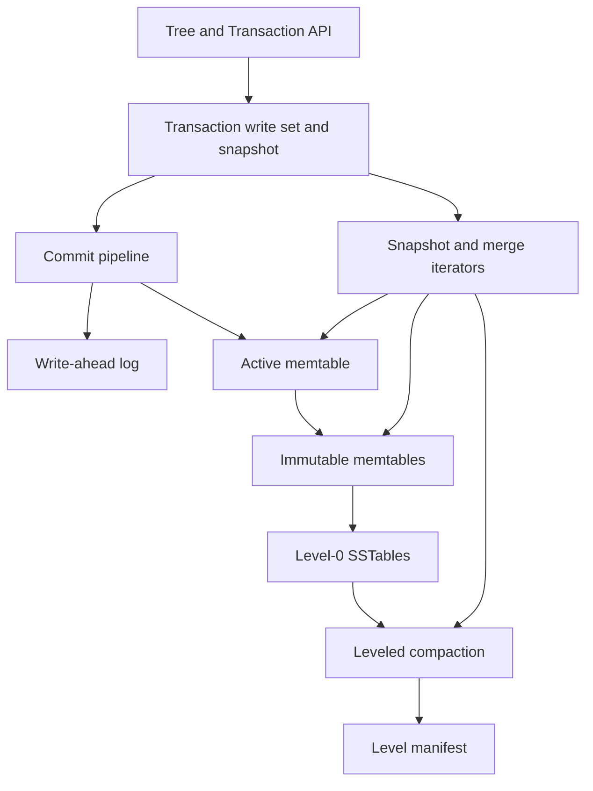

# SurrealKV Architecture

This document describes the current `v2` LSM engine after removal of value separation. Values have
one representation: the user bytes are stored inline in WAL batches, memtables, SSTables, and
compaction output.

## Components


```mermaid
flowchart TD
    API["Tree and Transaction API"] --> TXN["Transaction write set and snapshot"]
    TXN --> COMMIT["Commit pipeline"]
    COMMIT --> WAL["Write-ahead log"]
    COMMIT --> MEM["Active memtable"]
    MEM --> IMM["Immutable memtables"]
    IMM --> SST["Level-0 SSTables"]
    SST --> LEVELS["Leveled compaction"]
    LEVELS --> MANIFEST["Level manifest"]
    TXN --> READ["Snapshot and merge iterators"]
    READ --> MEM
    READ --> IMM
    READ --> LEVELS
```

- `transaction`: snapshot isolation, read-your-own-writes, range/history iteration, and commits.
- `commit`: serialized WAL ordering with concurrent apply and ordered visibility publication.
- `wal`: crash-durable framed batches.
- `memtable`: active and immutable skiplist-backed mutable state.
- `sstable`: immutable block tables, indexes, filters, properties, and checksums.
- `levels` and `compaction`: manifest state and leveled maintenance.
- `snapshot` and `oracle`: MVCC visibility, active-reader tracking, and conflict detection.
- `checkpoint`: consistent copies of SSTables, WAL structure, manifest, and metadata.

## Value representation

```text
WAL entry:      kind | key | raw value | timestamp
Memtable entry: InternalKey -> raw value
SST entry:      InternalKey -> raw value
```

There is no value tag, prefix, external pointer, secondary value file, read-time resolution step,
or second garbage-collection domain. A deletion is identified by `InternalKeyKind`, not by the
value bytes; empty user values therefore remain valid values.

The inline-only transition is a clean format break:

- WAL batch format is version 3 and rejects older versions.
- SST footer/properties format is `LSMV2` and rejects `LSMV1`.
- migration from an older store must be explicit and external.

## Write path

1. A transaction buffers mutations in its ordered write set.
2. The commit oracle validates the transaction snapshot and write keys.
3. The commit pipeline allocates sequence numbers and writes one version-3 batch to the WAL.
4. The exact same raw value bytes are applied to the active memtable.
5. Visibility is published in commit order.
6. Rotation moves a full active memtable to the immutable queue and advances the WAL.
7. Flush writes immutable entries directly into an `LSMV2` table before publishing it in the
   manifest.

Immediate durability synchronizes the WAL before acknowledgment. Eventual durability flushes to
the operating-system buffer cache without forcing stable media.

## Read path

Reads merge, in precedence order:

1. transaction-local writes;
2. the active memtable;
3. immutable memtables, newest first;
4. level 0 tables, newest first;
5. non-overlapping lower levels.

Internal keys order by user key and descending sequence number. Snapshot sequence numbers filter
future entries. Tombstone kinds hide deleted values. Iterator `value_encoded()` returns a borrowed
slice of the raw stored bytes; `value()` allocates only when the public owned `Value` result requires
ownership.

## MVCC and versioning

Every committed entry receives a monotonically increasing sequence number. Transactions read at a
fixed visible sequence and the oracle rejects conflicting writes. Optional timestamps support
time-based history selection but do not replace sequence numbers as the visibility order.

Active snapshots and transactions constrain compaction and conflict-history reclamation. Multiple
registrations at the same sequence must be counted independently.

## Flush and compaction

Flush and compaction preserve raw value bytes. Compaction merges sorted inputs, applies snapshot and
retention rules, writes one new immutable table, then commits a manifest change before obsolete
input tables are reclaimed.

The manifest is the authority for live tables, table IDs, WAL replay floors, and the last durable
sequence. Directory listing is used only for orphan cleanup, never as authoritative state.

## Recovery

On open, SurrealKV:

1. acquires the database lock;
2. loads and validates the manifest and referenced `LSMV2` tables;
3. replays version-3 WAL batches at or above the manifest replay floor;
4. restores the maximum durable/visible sequence;
5. removes unreferenced SST candidates conservatively;
6. starts bounded background flush and compaction work.

Malformed or old-format WAL/SST data fails closed. Recovery does not reinterpret tagged or pointer
values because those encodings are not part of the current format.

## Checkpoint and restore

A checkpoint flushes mutable state, then copies or links:

- all manifest-referenced SSTables;
- an empty/rebased WAL structure;
- the level manifest;
- checkpoint metadata.

Restore replaces those components and reopens through the normal validation/recovery path.

## Current host boundary

The current implementation is filesystem-oriented. Memory, simulated-failure, object-store,
Cloudflare, and browser adapters belong to the branch-native rewrite plan and are not claims of the
existing engine. Their storage interfaces must retain the same inline value representation and
branch/MVCC semantics.
