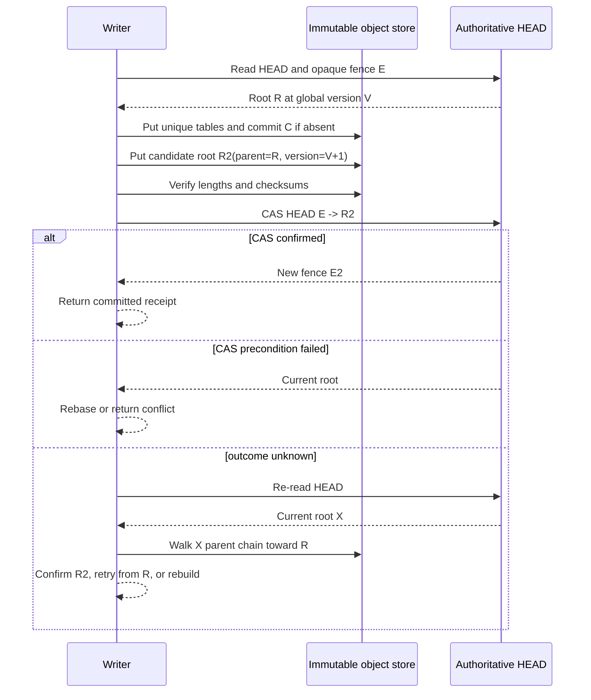

# Adversarial Review: Branch-Native SurrealKV on Local and Object Storage

Status: Architecture review

> **As-built v2 follow-up (2026-08-17):** verified runtime defects, disputed-finding adjudication,
> fixes, and red/green evidence are recorded in
> [BRANCHING_V2_ADVERSARIAL_FIX_LOG.md](BRANCHING_V2_ADVERSARIAL_FIX_LOG.md). The remaining
> whole-catalog publication cost is intentionally carried into this review's persistent-subobject
> metadata design rather than marked fixed in the numbered-manifest runtime.

Reviewed against:

- SurrealKV `v2`, including the completed B+tree removal at `2c9e8f3`;
- Strata's branch and storage architecture, especially
  `/Users/kfarhan/workspace/projects/strata-core/docs/architecture/strata-v1-design-overview.md`;
- SlateDB at `4b45c2f01fda568eff47e50012a63f9ddf1517a8` (2026-08-13);
- the proposed design in [BRANCHING_REWRITE_PLAN.md](BRANCHING_REWRITE_PLAN.md).

## Verdict

The rewrite is feasible, and one branch engine can retain identical branch semantics on memory,
local disk, object storage, Cloudflare Durable Objects plus R2, and browser OPFS. It is not feasible
by making a filesystem LSM generic over a file trait after the fact. The engine must be designed
around immutable objects, ranged reads, an explicit commit authority, and async execution before
the new table and WAL formats are frozen.

Strata does not contain all of the object-storage answer. It is the better source for integral
branch semantics: branch-keyed state, fork caps, generation fencing, inherited immutable tables,
and database-wide reachability. SlateDB is the better source for production-shaped object-store
mechanics: sequenced metadata, writer fencing, lost-response detection, range-oriented SST access,
cache separation, persistent compaction work, and object-aware GC races.

The recommended design is deliberately hybrid:

| Concern | Primary inspiration | SurrealKV decision |
| --- | --- | --- |
| Branch identity, lineage, fork cap | Strata | Integral branch catalog in one database root |
| COW inheritance | Strata | Global immutable object IDs plus capped inherited table views |
| Versioning | Strata plus MVCC LSM practice | One global commit version; timestamp is only a version selector |
| Branch diff and promotion | Strata plus Dolt concepts | Durable change journal and commit DAG; no Prolly-tree rewrite |
| Object I/O | SlateDB | Async range reads, streaming writes, checksummed sections, request tagging |
| Metadata transactions | SlateDB lessons, not its exact layout | Immutable unique root candidates plus one conditional authoritative `HEAD` |
| Lost responses | SlateDB | Per-operation identity plus read-after-unknown reconciliation |
| Compaction | SlateDB | Durable job state, fenced coordinator, stateless/resumable workers later |
| Reachability GC | Strata plus SlateDB failure cases | Root traversal, durable reader/operation pins, grace epochs, fail-closed deletion |
| Cloudflare edge | SurrealKV-specific | SQLite-backed Durable Object authority plus R2 immutable objects and intents |
| Browser | SurrealKV-specific | Dedicated worker, OPFS journal and dual root slots |

## What SlateDB adds beyond Strata

SlateDB is not merely another LSM example. Its current implementation and RFCs expose failure modes
that the original SurrealKV object plan must account for.

### 1. Metadata publication is a storage transaction

SlateDB stores immutable numbered manifest versions and commits by conditionally creating the next
number. It fences writers and compactors with epochs. Its cached probing protocol avoids a bucket
list on the steady-state read path, while listing remains a cold-start fallback.

SurrealKV should copy the principle—metadata publication is a fenced transaction—but not the
numbered filename protocol. A numbered protocol has a stale-writer resurrection race after GC:
once `N+1` is deleted, an old writer can create `N+1` again. SlateDB's draft GC-boundary design adds
a durable monotonic high-watermark to close that hole.

SurrealKV can avoid that entire ID-reuse class by using never-reused, content-addressed or random
candidate root IDs and a mutable conditional `HEAD`. The rule is strict: candidate root keys must
never be sequential reusable names.

### 2. A timeout can hide a successful write

SlateDB's retrying store attaches a unique put identity and, after timeout followed by
`AlreadyExists` or precondition failure, uses object metadata to determine whether the earlier
operation actually succeeded. It also retries a ranged read whose body fails after the request was
accepted.

SurrealKV needs equivalent typed outcomes:

- definitely not visible;
- definitely visible;
- visibility unknown;
- visible but selected durability not yet confirmed.

Blindly retrying `put-if-absent`, multipart completion, or `HEAD` CAS is unsafe. An unknown `HEAD`
CAS is reconciled by reading the current root and walking its parent chain: candidate present means
success; expected root still current means the CAS may be retried; a different child of the
expected root means the proposal lost and must be rebuilt.

### 3. WAL and main objects may need different media

SlateDB can place WAL objects in a distinct, lower-latency store and is designing a pluggable WAL.
It also avoids routing WAL through the normal object cache. This is useful for server deployments
where an S3-family table store is economical but too slow or costly for every foreground commit.

SurrealKV should keep the distinction behind `CommitAuthority`. The branch layer must not know
whether a commit became durable in a local journal, a remote append service, object commit chunks,
or Durable Object SQLite. A deployment must report exactly which medium is the acknowledgement
boundary. A separate table store must be descriptively identified in durable metadata so recovery
cannot silently bind to a different bucket or prefix.

### 4. Remote tables require a different read/write shape

SlateDB's table store uses section and block offsets, native byte ranges, coalesced uncached ranges,
streaming compacted-SST uploads, and separate filters/index/data caching. Concurrent point reads can
collapse onto one cache loader. Reads validate data and can evict and refetch a corrupt cached
entry.

SurrealKV should adopt these mechanics. A local-only format that requires whole-table reads, mmap,
rename, or an appended footer after remote upload will make the object backend an expensive
emulation rather than a first-class profile.

### 5. Compaction must survive process loss

SlateDB persists compaction specifications, ownership, progress, produced SSTs, and fencing epoch.
Its distributed design separates a single coordinator—the only component allowed to install a
manifest—from stateless workers. Workers may upload outputs, but only the coordinator makes them
reachable. It introduces an explicit `Compacted` state to distinguish “output complete” from
“manifest installed.”

SurrealKV should use the same state distinction even before distributed compaction exists. It
prevents recovery from guessing whether a completed output was published. Progress should be
checkpointed only at immutable SST boundaries initially; byte-granular resume is unnecessary.

### 6. Object GC races are structural, not just retention tuning

SlateDB documents two important counterexamples:

- a stale writer can resurrect a deleted sequential metadata ID;
- an uploaded but not-yet-published SST can be deleted if its time-derived ID orders before an
  already-published table.

SurrealKV must not base safety on object timestamps, ULID wall time, list order, or “old enough”
alone. GC candidates come from authoritative root traversal. Pending uploads, compaction outputs,
checkpoints, branch fork anchors, active snapshots, and reader leases are explicit roots or pins.
Age is an additional quarantine condition, never the liveness proof.

### 7. SlateDB clones are useful evidence, not the branch implementation

SlateDB clones create a separate database root, checkpoint the parent, reference external parent
SSTs, and copy WAL SSTs. Projection tracks visible ranges, and clones pin source data until detach.
This proves that immutable shared tables and range-limited views work on object storage.

It is not suitable as SurrealKV's integral branch substrate:

- every clone has a separate database path and manifest lineage;
- parent checkpoints become lifecycle pins;
- WAL state must be copied or specially handled;
- projection is constrained when unflushed WAL data exists;
- cross-branch promotion and one global version order become cross-root coordination;
- thousands of short-lived agent branches would multiply metadata roots and GC work.

SurrealKV should retain one database root and branch catalog, with global table IDs and explicit
fork caps.

## What the implemented Strata code teaches

The Strata architecture is valuable, but its implementation should be mined selectively rather
than ported. At the reviewed revision, the production Rust under `storage/src/branch` and
`storage/src/commit` alone is roughly 21,900 lines; with their colocated tests it is roughly 61,500
lines. This is evidence of mature coverage, but also evidence that copying the implementation shape
would violate the goal of a small, reusable KV core.

### Keep these implemented patterns

- **Immutable branch views.** `BranchLocalState` publishes an `Arc`-backed table layout so readers
  observe the old or new layout, never a half-installed flush/materialization.
- **Physical branch isolation.** Branch identity and descending commit version are part of the
  stored key. A generic name-to-ID catalog may live at SurrealKV's public API boundary, but table
  and LSM mechanics use only IDs and know no SurrealDB naming policy.
- **Generation guards.** Delete and same-name recreation fence old transactions and WAL replay.
- **Inherited table descriptors.** COW children reference immutable source tables with a fork
  version and explicit status.
- **Reachability facts before deletion.** Owned, inherited, materializing, and replacement table
  references are enumerated explicitly.
- **Capability validation and conformance.** Memory and local backends declare what they can prove;
  compiling an adapter does not certify a durable mode.
- **Typed publication outcomes.** Visibility and durability failures are not collapsed into a
  generic I/O error.
- **Testkit-first construction.** Backend conformance, model stores, property scripts, source
  guards, fault sweeps, and loom tests are built as architecture, not cleanup.

### Do not copy these complexity traps

1. **Do not require a fully flushed source to fork.** Strata's direct current-fork path rejects
   active/frozen rows, while its later historical path adds a hybrid one-table seal and an eager
   O(dataset) fallback. SurrealKV should define one rule from day one: freeze the source's bounded
   committed delta, publish at most one fork-delta table, then attach immutable view descriptors.
2. **Do not fall back to full materialization for fork-of-fork.** A child manifest should store a
   flattened list of direct table views and caps. Forking copies that bounded metadata, not the
   ancestor traversal algorithm. If the view-source budget is exceeded, return backpressure and
   schedule materialization; do not silently perform an O(dataset) fork.
3. **Do not make child recovery depend on the parent branch remaining live.** Strata contains a
   deletion guard for layer-less children whose recovery rebuilds from the source. In SurrealKV,
   every published child root directly references everything required for recovery. Deleting a
   branch removes a catalog root; shared objects remain reachable from children.
4. **Do not copy per-branch timestamp coverage state.** One persisted database commit timeline maps
   timestamps to global versions. Reads then use ordinary `AtVersion` visibility with branch birth
   and fork caps. This avoids seeding/copying timeline indexes through every fork.
5. **Do not put product workflows in the KV core.** Merge policy, JSON conflict semantics, graph
   rules, MCP, and user-facing branch names belong in SurrealDB or a higher library. SurrealKV owns
   byte-level compare facts and atomic conditional application.
6. **Do not copy Strata's synchronous backend boundary for Worker/browser targets.** Keep its
   object naming, capability, and conformance ideas; use an async SurrealKV contract.
7. **Do not require authoritative listing.** Strata's unimplemented object-durable candidate still
   names consistent listing and monotonic metadata. SurrealKV recovery follows `HEAD` and immutable
   references; listing is advisory GC inventory only.

### Strata's build workflow is worth copying in smaller form

Strata does not rely on an agent to infer the entire architecture on each task. Its repository
instructions establish a reading order, hard dependency rules, milestone/slice identifiers, one
behavior owner per change, matching implementation and test tracks, and an approximate 1,500-line
net-change ceiling. Each slice identifies the existing code being ported, adapted, or replaced and
has commands and exit gates. Architectural absence is even guarded by tests—for example, V1 fails
if merge/revert/cherry-pick vocabulary reappears without a deliberate post-V1 plan.

SurrealKV should use the following lighter loop for human or coding-agent implementation:

```text
read invariant card
  -> inspect current corresponding code
  -> classify port / adapt / fresh
  -> add failing conformance or model case
  -> implement one vertical behavior
  -> run focused + parity + guard tests
  -> record evidence and close the slice
```

Every implementation issue should contain only: objective, owned files, invariants, non-goals,
predecessors, test slice, verification commands, and exit evidence. Planning codes stay in issues
and docs, never production names.

Strata also has a separate product-facing agent surface: `strata agents guide`, machine-readable
command and error catalogs, repo onboarding, installable Claude/Cursor/Codex instructions, and MCP.
The useful lesson for SurrealKV is self-description—stable error codes, capabilities, commit
receipts, idempotency, and concise examples. SurrealKV should not embed MCP, CLI orchestration, or
model-provider behavior. Those belong above the storage library.

## Adversarial findings against the proposed design

### P0 — root publication was underspecified

“Conditional root CAS” is not enough. The protocol must define bootstrap, object naming, unknown
outcomes, lineage reconciliation, and root loss.

Required invariant:

1. `HEAD` is conditionally created exactly once and is never deleted.
2. Every candidate root has a globally unique immutable ID, checksum, parent root ID, database ID,
   next global version, and complete references to catalog/timeline/branch state.
3. Candidate objects are uploaded and verified before CAS.
4. CAS compares the provider's opaque version token, not a timestamp.
5. Unknown CAS outcomes are reconciled by root-lineage traversal.
6. A missing `HEAD` after initialization is corruption; recovery fails closed and never reconstructs
   authority from listing.

### P0 — atomic branch state was not explicit

A data commit may update a branch head, global version, commit timeline, change journal, quotas,
and catalog generation together. These cannot be independently mutable object-store files.

The immutable candidate root must describe one atomic `DatabaseState`, or point to one immutable
commit record whose application deterministically yields it. `HEAD` publication is the only
visibility point. Cloudflare's Durable Object implementation performs the equivalent changes in
one SQLite transaction.

### P0 — a single global root is a correctness win and a throughput bottleneck

Global versions, atomic promotion, and database-wide branch catalog updates make one publication
order the smallest correct first design. It also serializes commits to unrelated branches.

Do not hide this. Add group commit, measure CAS retries and commits per second, and publish a profile
budget. Sharding by branch is future work requiring a distributed protocol for fork, promotion,
global ordering, and GC—not a configuration switch.

### P0 — writer leasing must share the root's fencing domain

A lease object checked separately from `HEAD` has a time-of-check/time-of-use hole: a stale process
can validate the old lease and then publish after takeover. Put the writer epoch in `HEAD`.
Takeover conditionally advances that epoch even if the referenced database root does not change;
every commit compares the opaque `HEAD` version and the session epoch. Renewal and expiry policy
must name a proved time source. When a generic provider cannot supply one, session takeover is an
explicit administrative operation rather than an unsafe automatic timeout.

### P0 — remote readers need durable liveness

In-process reader pins are insufficient when multiple processes read object-only storage. A reader
can hold an old root while GC deletes its tables.

The certified multi-process profile requires renewable snapshot leases recorded by the commit
authority, or a deliberately bounded snapshot lifetime plus a GC grace epoch exceeding it. GC
includes active leases and fails closed when lease state cannot be read. The planned initial
object-only certification allows one active writer and only bounded remote snapshots; unbounded
multiprocess readers wait for durable reader leases.

### P0 — acknowledgement semantics differ by profile

“Committed” must mean the selected authority is durable, not merely that data reached a memtable.

- Memory: visible in-process, ephemeral.
- Local: journal and root durable according to the configured sync policy.
- Object-only: immutable dependencies verified and `HEAD` publication confirmed.
- Cloudflare edge: commit row/catalog/root committed in Durable Object SQLite; R2 flush may follow
  under a durable intent.
- OPFS: journal/root flushed, with device-local best-effort durability classification.

The API should return a `CommitReceipt` containing version, branch head, durability class, and
authority fence.

### P0 — GC needed operation pins, not only reachability

Root traversal sees installed objects, not uploads in flight. Every flush, compaction, relocation,
snapshot, and fork materialization needs a durable operation record that pins inputs and identifies
candidate outputs. Installation and cleanup are separate state transitions. Unknown state leaks
objects; it never authorizes deletion.

### P1 — cache and coordination traffic must be separated

Data blocks can use local/distributed caches. Authority roots, fences, leases, and GC boundaries
cannot be served from an ordinary stale cache. Cache wrappers need request tags and corruption
recovery. Wrapper order should be specified and tested:

```text
provider -> instrumentation -> bounded retry -> optional data cache -> engine
```

Authority traffic bypasses the data cache.

### P1 — multipart upload changes idempotency

Generic multipart APIs often cannot express create-only semantics. Candidate keys must be unique,
so an accidental overwrite cannot alias a live object. Completion needs an operation ID and
reconciliation. Small fencing/WAL objects remain on conditional single-PUT paths unless a provider
has a proven multipart equivalent.

### P1 — clock-derived object identity is too risky for correctness

Use content hashes or cryptographically random IDs. Wall time may be metadata and a conservative GC
quarantine input, but never the publication order, uniqueness proof, or reachability cutoff.

### P1 — Cloudflare maintenance must be resumable

Durable Object SQLite and R2 are not one transaction, and Worker requests are bounded. Flush,
compaction, GC, and relocation must be restartable state machines driven in small steps by alarms or
queues. “Run background compactor” is not an implementable edge design.

### P1 — portability requires async and conditional thread-safety

The core should expose async operations without promising `Send` on browser/Worker targets. Native
profiles can enable `Send + Sync` executors and a blocking facade. A universal synchronous trait or
unconditional Tokio/thread dependency would exclude the requested WASM profiles.

## Chosen object-only commit protocol



This protocol is preferred over copying SlateDB's numbered manifests because it gives constant-cost
latest-root discovery and avoids sequence-ID resurrection. It is certified only on providers with
strong read-after-write for the authority object, create-only immutable puts, opaque conditional
update, native ranges, and a tested unknown-outcome path. Providers that lack conditional update
are read-only or unsupported initially; a sequenced-create authority would be a separate protocol
with its own durable GC boundary and proof.

## Local evidence inspected

Strata:

- `/Users/kfarhan/workspace/projects/strata-core/CLAUDE.md` for hard invariants, slice discipline,
  test-track pairing, and agent skills;
- `docs/architecture/storage/l1-backend-io.md` and
  `future-object-durable-guardrails.md` for the implemented/deferred backend boundary;
- `crates/storage/src/backend/` for capabilities, Memory/Local implementations, publication
  outcomes, and conformance;
- `crates/storage/src/branch/state/fork.rs` and
  `crates/storage/src/lifecycle/branch_lifecycle.rs` for COW, hybrid sealing, eager fallback,
  generation, and source-deletion constraints;
- `crates/storage/src/testkit/` for reference models, fault sweeps, and generated commit/branch
  scripts;
- `crates/cli/src/agents.rs` and `agents_skill.md` for machine-readable agent onboarding.

SlateDB:

- `slatedb-txn-obj/src/object_store.rs` and `slatedb/src/manifest/store.rs` for sequenced immutable
  metadata and conditional creation;
- `slatedb/src/retrying_object_store.rs` for retry and lost-response identity;
- `slatedb/src/tablestore.rs` and `slatedb/src/cached_object_store/` for ranged reads, streaming
  table writes, request tags, cache separation, and corruption retry;
- `slatedb/src/clone.rs` and `slatedb/src/paths.rs` for checkpointed external-table clones;
- RFCs 0009, 0013, 0025, 0026, 0027, 0029, 0030, and 0032 for separate WAL storage, persistent/
  distributed compaction, GC races, cache boundaries, pluggable WAL, and metadata discovery.

Draft RFCs were treated as failure analyses or proposals, not as proof that their mechanisms are
shipped. Claims about current mechanics were cross-checked against source.

## Final go/no-go result

Proceed with the rewrite, subject to these constraints:

- Strata branch semantics remain above all backend implementations.
- SlateDB clone/path semantics are not adopted as the branch model.
- The object format and async storage contracts are frozen before rebuilding the LSM.
- Memory, Local, and SimStorage prove semantics before remote certification.
- Object-only multi-process operation is not claimed until reader leases and writer/compactor
  fencing are durable.
- Cloudflare uses a Durable Object as authority; R2 alone is not the multi-writer sequencer.
- No backend is called durable until its crash matrix, lost-response tests, and cost/limit budgets
  pass.

The detailed work order and dependency gates are in
[BRANCHING_IMPLEMENTATION_PLAN.md](BRANCHING_IMPLEMENTATION_PLAN.md).
