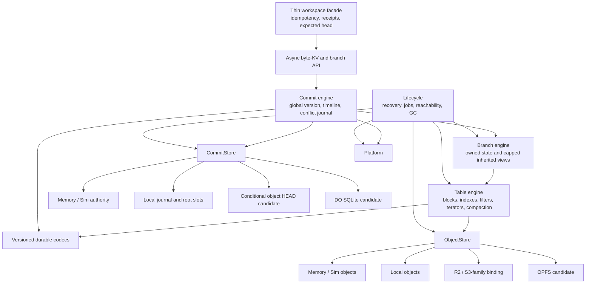
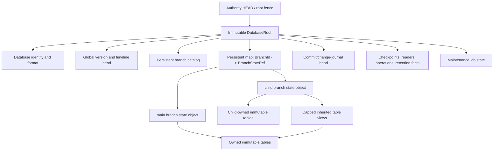
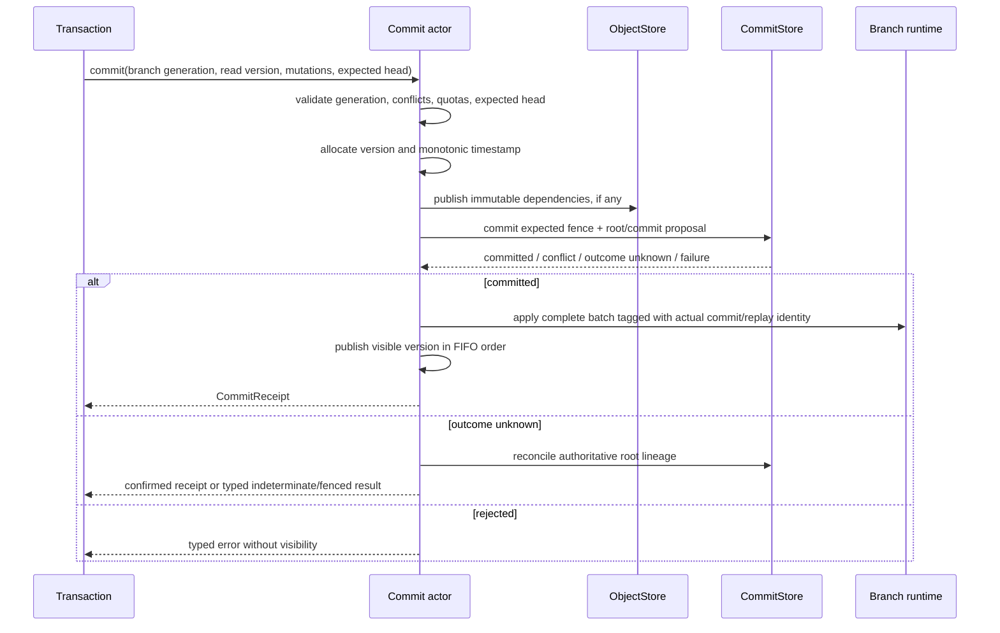
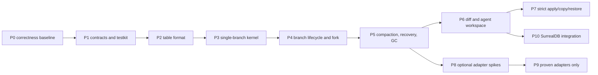

# Branch-Native SurrealKV Rewrite: Consolidated Architecture and Implementation Plan

Status: Proposed canonical plan

This document consolidates the strongest parts of:

- `BRANCHING_REWRITE_PLAN.md`;
- `BRANCHING_IMPLEMENTATION_PLAN.md`;
- `BRANCHING_ADVERSARIAL_REVIEW.md`;
- `/Users/kfarhan/.claude/plans/ignore-bplustree-understand-how-harmonic-eclipse.md`;
- the inspected Strata and SlateDB implementations.

When those documents disagree, this document owns the target architecture and work order. The
older documents remain evidence and design history, not parallel specifications.

The plan assumes a complete durable-format and public-API reset. It does not preserve old stores,
the old transaction API, arbitrary per-entry MVCC timestamps, the B+tree, or VLog behavior.

## 1. Outcome and release cuts

SurrealKV becomes an LSM-only, branch-native byte KV engine with:

- one globally ordered commit version and commit timestamp timeline;
- writable branches with durable identity and generation fencing;
- exact current, version, and timestamp-resolved forks;
- copy-on-write inheritance through immutable table references;
- point, range, reverse, history, and as-of reads on every branch;
- branch-local writes, flush, compaction, recovery, and backpressure;
- safe branch deletion and same-name recreation;
- database-wide reachability and fail-closed reclamation;
- bounded diff and a thin agent workspace API;
- later, strict byte-level promotion/copy/restore;
- the same branch semantics on every backend that passes certification.

Release cuts are intentionally independent:

1. **Core branch release:** Memory, Local, and SimStorage.
2. **Agent workflow release:** diff, idempotent workspace creation, receipts, expected-head writes,
   and bounded cleanup.
3. **Change-application release:** strict byte-level promotion/copy/restore.
4. **Optional adapter releases:** object-only, Cloudflare edge, OPFS, and server hot/cold profiles,
   each certified separately and omitted if it requires core complexity or semantic divergence.

Cloudflare, OPFS, object-only durability, blobs, and distributed compaction do not block the core
branch release.

## 2. Binding architectural decisions

These decisions are settled unless a failing vertical proof forces a written amendment.

| Concern | Decision | Why |
| --- | --- | --- |
| Compatibility | Clean break | Avoid dual formats, shims, and ambiguous semantics. |
| B+tree | Absent | Commit-version visibility and timeline resolution fit the LSM. |
| VLog | Removed completely | Avoid a second cross-branch lifetime and GC domain. |
| Values | Inline in WAL/memory/SSTs | One value representation on every backend. |
| MVCC order | One global `CommitVersion` | Fork caps and cross-branch ordering remain scalar. |
| Time | One database commit timeline | Timestamp resolves once to a version; no child timeline seeding. |
| Row key | `user_key + descending version + kind` | Branch-pure components make a row-level BranchId redundant. |
| Table ownership | One physical branch/generation per SST | Preserves isolation without row-key rewriting. |
| Mutable state | Lazy branch-local active/frozen tables | Idle branches consume catalog/reference memory only. |
| Metadata authority | One logical `DatabaseRoot` publication point | Global version, timeline, catalog, branch heads, and pins change atomically. |
| Root size | Persistent immutable subobjects | A single authority does not require rewriting the whole catalog. |
| Fork | Immutable views plus at most one bounded fork-delta | Exact semantics without a dataset copy. |
| Nested fork | Flattened direct views with hard budgets | Recovery never depends on a live ancestor or recursive reads. |
| Full-copy fallback | Forbidden | Budget pressure returns typed backpressure/materialization-required. |
| Diff | Commit change journal plus full-scan oracle | Normal cost follows changed keys; correctness remains testable. |
| Merge | Strict byte facts and expected-head apply, later | Product-aware merge remains above SurrealKV. |
| Core host seam | `ObjectStore`, `CommitStore`, `Platform` | Three roles cover immutable data, authority, and runtime facts. |
| Required backends | Memory, Local, SimStorage | Smallest useful and testable durable foundation. |
| Optional backends | Proof-gated adapters | A desired target cannot distort branch/MVCC semantics. |
| Native remote object mechanics | Wrap the Arrow `object_store` crate | Reuse S3/R2-family ranges, multipart upload, retries, credentials, and provider errors; do not rebuild an HTTP object client. |

### 2.1 Consolidation ledger

| Prior proposal | Disposition in this plan |
| --- | --- |
| Put `BranchId` in every internal key, as in Strata's namespaced-key lineage | Rejected: branch-pure physical components preserve the comparator, bloom filters, and block format. |
| Per-branch component sets are sufficient for COW | Accepted with a correction: immutable table views cover sealed data, but exact `Head` fork also needs one bounded child-owned delta for committed unsealed rows. |
| B+tree is already gone on `v2` | Verified and accepted; add an absence guard rather than removal work. |
| One portable async core can serve every host | Accepted for semantics and formats; durability authority and scheduling remain adapter-specific, and each optional host must pass a spike. |
| Cloudflare requires a completely separate edge engine | Not established: current Rust bindings expose R2, DO routing, and DO SQLite. Try one thin authority/object adapter; defer it if the simplicity gate fails. |
| Fix four current LSM bugs before all branch work | Keep all four as mandatory regressions; patch the legacy runtime only if it must ship during the rewrite. |
| Keep VLog because branching does not technically require its removal | Rejected for this rewrite: it adds a second reachability and GC protocol across every backend. |
| Implement every Strata backend as one first-party release | Rejected: copy its capability-seam discipline, not its commitment surface. |
| Borrow SlateDB's object-store LSM shape wholesale | Rejected: borrow immutable ranged objects, caches, and publication lessons; retain SurrealKV's branch/MVCC contract and prove authority separately. |
| Constitution, small slices, sabotage tests, and CI-enforced absence | Accepted selectively: invariant cards, implementation/test pairs, adversarial gates, and focused guards; no process artifact without a failure it prevents. |

### 2.2 Explicit non-goals

The initial architecture does not include:

- old-store migration or dual reads/writes;
- a mutable VLog or an automatic immutable blob replacement;
- BranchId bytes in every stored row;
- one manifest or WAL per branch;
- per-branch commit clocks or copied timestamp indexes;
- dataset-copy fallback during fork;
- recursive reads through live parent branches;
- multi-writer object-only commits;
- per-branch Durable Objects;
- cross-database or cross-authority atomic transactions;
- rebase, tags, criss-cross merge, schema merge, JSON merge, or graph merge;
- model-provider, prompt, MCP, or agent-orchestration code in the KV engine;
- identical latency or durability claims across backends.

### 2.3 Verified current baseline

The `v2` worktree was checked on 2026-08-13:

- the B+tree implementation and public surface are already absent, so the work is an
  enforced-absence guard, not a removal project;
- VLog, its value prefix/pointer resolution, metadata, public configuration, lifecycle, and
  dedicated tests were removed in commit `4b07fce`;
- P0 fixes and measurements are recorded in `P0_CORRECTNESS_BASELINE.md`; the four failure scenarios
  remain mandatory regressions for the replacement spine.

Recheck this baseline before opening implementation issues; paths may move while the architectural
invariants do not.

### 2.4 Phase -1: as-built v2 adversarial remediation (2026-08-17)

Before further format work, the current runtime was challenged with vertical regressions for merge
bases, catalog churn, restore identity/runtime replacement, checkpoint cuts, historical forks, WAL
pin cleanup, lock order, and metric/API contracts. The fixes and observed red/green outputs are in
[BRANCHING_V2_ADVERSARIAL_FIX_LOG.md](BRANCHING_V2_ADVERSARIAL_FIX_LOG.md).

One performance item deliberately crosses into Phase 1: branch mutations still rewrite the entire
live catalog. Tombstone retirement prevents the fixed 4,096-entry lifetime-exhaustion failure, but
does not make publication incremental. Phase 1's persistent immutable metadata subobjects must add
format-level crash tests and branch-count benchmarks before replacing that path.

## 3. Architecture

### 3.1 Layer and host boundary



Only adapters import platform-specific filesystem, Cloudflare, browser, io_uring, credential, or
SDK types. Branch, commit, table, format, and lifecycle code know none of them.

### 3.2 One logical authority root



`DatabaseRoot` is logical. A native `CommitStore` may encode it as journal records plus periodic
snapshots; an object adapter may publish a small immutable candidate and CAS one `HEAD`; a Durable
Object adapter may update an equivalent root row transactionally. All expose one semantic root
transition and one opaque fence.

There are no independently authoritative per-branch HEAD objects in the first design. Persistent
maps/subobjects prevent root publication from serializing the entire branch catalog on every
commit. Publication remains globally ordered; sharding that authority is a separate future
distributed-systems design.

## 4. Durable model and formats

### 4.1 Identifiers and row ordering

```rust
struct DatabaseId([u8; 16]);
struct BranchId([u8; 16]);
struct BranchGeneration(u64);
struct CommitVersion(u64);
struct CommitTimestamp(u64);
struct TableId([u8; 32]);
struct RootId([u8; 32]);
```

Identifiers use injected randomness/clock facts, are never reused, and are never derived from a
restorable catalog counter. Content digests may be used when the format permits streaming digest
calculation; otherwise IDs remain random and the object carries a separate full digest.

Rows do not contain a branch prefix:

```text
InternalKey = user_key | descending_commit_version | row_kind
StorageRow  = InternalKey | commit_timestamp | expires_at | value
```

Requirements:

- all versions of a user key are contiguous and newest first;
- future versions, malformed lengths, trailing data, and invalid kinds fail closed;
- timestamp is commit metadata/selector, not a second visibility order;
- user-provided event time is payload or commit metadata, never MVCC order;
- bloom filters operate on the user key;
- values are inline;
- every durable structure has magic, format version, bounded lengths, and checksum.

### 4.2 Branch-pure table descriptor

Every SST contains rows for exactly one physical owner:

```rust
struct TableRef {
    table_id: TableId,
    owner_branch: BranchId,
    owner_generation: BranchGeneration,
    smallest_user_key: Bytes,
    largest_user_key: Bytes,
    smallest_version: CommitVersion,
    largest_version: CommitVersion,
    object_len: u64,
    digest: [u8; 32],
    format_version: u16,
    max_commit_timestamp: CommitTimestamp,
}
```

The footer repeats and authenticates the owner and critical ranges. Loading a table through a
manifest/view with a mismatched owner, generation, digest, or range is corruption. Table IDs, not
paths or branches, key caches and reachability.

### 4.3 Branch state

```rust
struct BranchState {
    descriptor: BranchRecord,
    owned_levels: PersistentLevels,
    inherited_views: Vec<InheritedView>,
    replay_floor: ReplayFloor,
    retention: RetentionFacts,
}

struct InheritedView {
    source_branch: BranchId,
    source_generation: BranchGeneration,
    table: TableRef,
    max_visible_version: CommitVersion,
    precedence: u16,
}
```

Active/frozen tables, conflict oracle state, snapshot registrations, and write buffers are runtime
state keyed by branch identity. They are created lazily. The durable branch state records only
facts required for recovery.

Forking flattens views: the child directly references every immutable table needed for recovery.
It does not store an instruction to ask its parent later.

### 4.4 Database root

One root transition atomically establishes:

- next globally publishable version and timestamp;
- branch catalog and name/generation state;
- branch-state references and branch heads;
- commit/change-journal entry;
- retained-history floors;
- checkpoints and durable reader/operation pins;
- maintenance installation state;
- authority epoch/fencing state.

Large maps and histories are persistent immutable subobjects. A root candidate names its parent
root, database identity, root generation, complete referenced-object digest, and authority epoch.

## 5. Read, commit, fork, compaction, and recovery protocols

### 5.1 Unified branch reads

For a read selector, resolve one temporal context:

```text
Latest          -> current published version, current monotonic time
AtVersion(V)    -> V, global commit timestamp for V
AtTimestamp(T)  -> latest global commit version at or before T, evaluation time T
```

The branch read stack is:

1. active table;
2. frozen tables;
3. branch-owned levels;
4. flattened inherited table views, each capped at `min(requested, max_visible_version)`.

All sources use the same merge iterator ordered by:

```text
user_key ascending, commit_version descending, source precedence
```

The global commit version makes post-fork child rows newer than every visible inherited row.
Duplicate references to the same `(table_id, key, version)` are coalesced. The newest visible row
wins; a tombstone or expiry masks older owned and inherited values. Point, forward/reverse range,
prefix, history, TTL, and compaction use the same visibility helper.

No inherited read rewrites physical keys.

### 5.2 Commit protocol

One asynchronous commit actor serializes version publication and supports group commit.



Invariants:

- one transaction has one version and timestamp;
- branch ID/generation are fixed-width commit fields;
- acknowledged commits are durable according to the selected profile;
- the actual WAL/commit segment identity travels with the applied batch;
- memtables track the minimum replay segment of all contained batches;
- apply failure after durable authority fences further fork/commit until recovery;
- replay is duplicate-tolerant from the durable replay floor;
- publication is FIFO and never exposes a partial multi-key transaction.

### 5.3 Exact fork protocol

`Head` always means the exact visible source head. `AtVersion` and `AtTimestamp` are equally exact.
An optional explicitly named `LastDurable` selector may expose a cheaper older point; it is never
silently substituted for `Head`.

```mermaid
sequenceDiagram
    participant U as Caller
    participant C as Commit actor
    participant S as Source runtime
    participant O as ObjectStore
    participant A as CommitStore

    U->>C: fork(source, destination, selector, idempotency key)
    C->>C: validate names, generations, destination absence
    C->>C: drain earlier commit publication and resolve fork version F
    C->>S: capture owned tables, inherited views, and committed unsealed rows <= F
    C->>C: register operation pins; release source write fence
    opt unsealed committed rows exist
        C->>O: publish one child-owned bounded fork-delta table
    end
    C->>C: flatten/coalesce views and cap every view at F
    alt source/view/delta budget exceeded
        C-->>U: MaterializationRequired or retryable backpressure
    else within budget
        C->>A: atomically publish child catalog/state in DatabaseRoot
        A-->>C: committed root fence
        C-->>U: ForkReceipt(branch id, generation, F, root)
    end
```

Fork correctness requirements:

- every committed row visible to the source at `F` is covered by an immutable referenced table or
  the fork-delta;
- rows above `F` are hidden by the view cap;
- operation pins prevent compaction/GC from reclaiming captured source tables before publication;
- bounded delta upload does not hold the global commit actor: completion re-enters the actor and
  rebases the catalog addition onto the current root while revalidating source generation,
  destination absence, retention of `F`, and the caller's optional expected-head condition;
- ordinary parent commits after the captured `F` do not invalidate the fork; they are preserved in
  the rebased parent state but remain above the child's cap;
- failure before root publication creates no visible branch and may leak only orphan candidates;
- failure after publication recovers entirely from the child root without the parent;
- parent commits after `F` do not force the fork to retry and are invisible to the child;
- no path performs a full source scan/copy as fallback;
- bounded delta/view limits are configuration and observable metrics, not hidden latency cliffs.

The required Memory/Local implementation uses process-local operation pins while the bounded fork
is running. A crash before root publication aborts the fork, so no durable pending branch exists.
An optional adapter that offloads or resumes fork construction must first add a durable operation
pin through an ordinary root transition; it may not invent a second catalog authority.

### 5.4 Compaction and retention

Ordinary compaction consumes only branch-owned tables. Inherited views are immutable inputs to
reads, not silently rewritten by parent or child compaction. Materialization is a distinct
operation that reads a bounded inherited layer, writes child-owned output, and atomically swaps
views after verification.

Retention boundaries include:

- active snapshots and transactions;
- retained commit/time floors;
- diff/promotion bases and unfinalized change-application intents;
- checkpoints and durable reader leases;
- operation pins.

Fork descendants do not require parent compaction to retain logical versions: children already
reference the exact immutable parent tables. Those table references themselves keep objects live.

Tombstone rules:

- a tombstone may disappear only when no older visible value can be exposed by a snapshot,
  retained base, or inherited layer;
- a branch with inherited views is not at the bottom of its complete read stack;
- when an older version is retained for a boundary, the covering tombstone is retained too;
- bottom-level deletion and snapshot preservation are tested together, not independently.

### 5.5 Recovery

Recovery follows authority, never naming convention or listing:

1. Load the exact root named by the authoritative fence.
2. Verify database identity, parent/root linkage, format, bounds, and checksums.
3. Advance/fence the writer epoch according to the selected `CommitStore`.
4. Load exact branch-state/table references.
5. Rebuild runtime registries and in-memory reference counts.
6. Resolve installed/pending maintenance operations idempotently.
7. Replay duplicate-tolerantly from recorded floors, rejecting inactive/stale generations.
8. Seed the global version/timestamp frontier from authoritative commits.
9. Enable reclamation only after full reachability validation succeeds.

Normal open never silently falls back to an older root after corruption. A separate repair tool may
inspect parent roots and produce an explicit recovery report.

### 5.6 Reachability and reclamation

An object is live when reachable from the current root or from a certified pin:

```text
branch owned/inherited tables
commit and timeline segments
checkpoints
durable readers
flush/compaction/fork/materialization operations
quarantine records
```

Deletion requires:

1. complete root traversal;
2. no live/pinned reference;
3. a recorded release candidate;
4. a deletion delay;
5. a second independent reachability cycle;
6. successful delete or a leak-only diagnostic.

Any missing/corrupt root, branch state, operation record, or pin disables deletion for the process
lifetime. Listing discovers possible orphans but never proves death. Uncertainty leaks space or
stops writes; it never deletes reachable data.

## 6. Host interfaces and backend profiles

### 6.1 Three roles only

The core is parameterized over exactly three roles initially:

```rust
trait ObjectStore {
    async fn read_range(&self, id: &ObjectId, range: ByteRange) -> Result<Bytes>;
    async fn put_unique(&self, request: PutRequest) -> Result<PutOutcome>;
    async fn metadata(&self, id: &ObjectId) -> Result<ObjectMetadata>;
    async fn list_page(&self, prefix: &ObjectPrefix, cursor: Option<ListCursor>)
        -> Result<ObjectPage>;
    async fn delete(&self, id: &ObjectId) -> Result<DeleteOutcome>;
}

trait CommitStore {
    async fn open(&self, mode: OpenMode) -> Result<AuthoritySession>;
    async fn load_root(&self, session: &AuthoritySession) -> Result<AuthorityRoot>;
    async fn commit(
        &self,
        session: &mut AuthoritySession,
        expected: AuthorityFence,
        proposal: CommitProposal,
    ) -> Result<CommitOutcome>;
    async fn reconcile(&self, operation: OperationId) -> Result<ReconcileOutcome>;
}

trait Platform {
    fn now(&self) -> MonotonicTime;
    fn fill_random(&self, out: &mut [u8]) -> Result<()>;
    fn memory_budget(&self) -> MemoryBudget;
    async fn schedule_maintenance(&self, hint: MaintenanceHint) -> Result<()>;
}
```

Traits use conditional `Send` bounds so native can be multi-threaded while workerd/browser futures
may remain local. A fourth behavior-bearing core trait requires an architecture review. Block
cache, DO hot rows, io_uring buffers, filesystem locks, and retry wrappers are internal components
or adapter decorators, not additional semantic roles.

Native S3/R2-family adapters should wrap the Arrow `object_store` crate (as SlateDB does) rather
than implement remote HTTP, multipart upload, retry, credential, or provider logic. SurrealKV's
smaller contract remains the semantic boundary because it adds unique immutable publication,
capability/durability negotiation, and stable errors. A workerd R2 binding is a separate thin
adapter candidate: it must not pull a native HTTP/AWS runtime into the isolate merely to share an
implementation. The Local adapter may use `object_store::local::LocalFileSystem` only if the P8
audit proves equivalent create-only publication plus file/directory durability; otherwise its
small fsync container remains local durability machinery, not a second remote client.

### 6.2 Profile matrix

| Profile | Objects | Commit authority | Status and promise |
| --- | --- | --- | --- |
| Memory | RAM | In-process serialized state | Required; ephemeral reference behavior. |
| SimStorage | Faultable deterministic objects | Scripted authority/fence | Required peer backend under parity suite. |
| Local | Canonical immutable files | Framed journal + durable root slots + writer lock | Required crash-durable single-host mode. |
| Object-only | R2/S3-family binding | Conditional HEAD or proved host-single-writer protocol | Candidate; low-write/single-writer only until measured. |
| Cloudflare edge | R2 binding | One SQLite-backed DO per database | Candidate; bindings stay in adapter crate. |
| OPFS | OPFS objects in dedicated worker | Journal + dual root slots | Candidate; device-local best effort. |
| Server tiered | Object-authoritative data with NVMe cache, or explicit local authority | Exactly one selected authority | Candidate; archive is not automatic failover. |

### 6.3 Optional-adapter simplicity gate

Before implementing an optional profile, run one bounded spike. Stop and defer the profile if it
requires any of:

- a separate branch/MVCC/read implementation;
- a fourth core host role;
- platform globals or credentials in core code;
- a substantial JavaScript protocol layer rather than a thin binding adapter;
- resident background loops where the host requires resumable events;
- full-object buffering near the host memory ceiling;
- weakened atomicity, durability, history, or branch isolation;
- provider listing as recovery authority;
- more than one additional implementation slice plus one test/certification slice beyond the
  adapter after the feasibility spike.

A failed spike is documented and omitted. It does not delay Memory, Local, SimStorage, or another
independently proven adapter.

### 6.4 Cloudflare binding candidate

Cloudflare exposes bindings as injected capabilities. The candidate adapter uses:

- Rust `workers-rs` `Bucket` for R2;
- `ObjectNamespace` for Durable Object routing;
- Rust Durable Object `State::storage().sql()`/`SqlStorage` for authority;
- request/Alarm-driven bounded maintenance;
- streaming R2 range reads and uploads.

Evidence checked against the current platform documentation on 2026-08-13:

- [Workers bindings](https://developers.cloudflare.com/workers/runtime-apis/bindings/) are injected
  capability/API handles rather than credentials passed into the core;
- Cloudflare's [Rust support](https://developers.cloudflare.com/workers/languages/rust/) exposes R2
  `Bucket` and Durable Object `ObjectNamespace`, while the current
  [workers-rs reference](https://github.com/cloudflare/workers-rs#sqlite-storage-in-durable-objects)
  exposes `state.storage().sql()`/`SqlStorage`;
- the R2 Workers API supports [ranged reads and conditional `put` via `onlyIf`](https://developers.cloudflare.com/r2/api/workers/workers-api-reference/);
- R2 is [strongly consistent](https://developers.cloudflare.com/r2/reference/consistency/), but
  concurrent same-key writes are last-completer-wins and the documented
  [same-object-name write limit](https://developers.cloudflare.com/r2/platform/limits/) constrains a
  hot mutable `HEAD`;
- Durable Object SQLite is the recommended new storage backend, but
  [DO/Workers resource limits](https://developers.cloudflare.com/durable-objects/platform/limits/)
  and [Alarm at-least-once delivery](https://developers.cloudflare.com/durable-objects/api/alarms/)
  require bounded, idempotent event handlers.

SQLite and R2 are not one transaction. The safe ordering is:

1. record or derive a bounded operation identity;
2. publish and verify immutable R2 dependencies;
3. perform one conditional SQL root transition;
4. acknowledge only after SQL authority commits;
5. recover orphan-before-install and installed-before-cleanup states idempotently.

R2 conditional writes make a low-rate object-only `HEAD` plausible, not proven. Its same-key limit
makes it unsuitable for high-rate commits. High-rate Cloudflare writes use the DO authority or are
unsupported. No Cloudflare durability claim is made until a deployed workerd/R2/DO parity, crash,
memory, CPU, and subrequest suite passes.

## 7. Public and agent-facing API

The byte-KV API remains small:

```rust
impl Database {
    async fn open(bindings: Bindings, options: Options) -> Result<Self>;
    async fn begin(&self, branch: &str) -> Result<Transaction>;
    async fn create_branch(&self, name: &str, request: CreateBranch) -> Result<BranchReceipt>;
    async fn fork_branch(&self, request: ForkRequest) -> Result<ForkReceipt>;
    async fn delete_branch(&self, request: DeleteBranch) -> Result<BranchReceipt>;
    async fn list_branches(&self) -> Result<Vec<BranchInfo>>;
    async fn diff(&self, request: DiffRequest) -> Result<DiffPage>;
}

impl Transaction {
    async fn get(&self, key: &[u8], selector: ReadSelector) -> Result<Option<Bytes>>;
    fn scan(&self, range: KeyRange, selector: ReadSelector) -> Result<AsyncScan>;
    fn set(&mut self, key: Bytes, value: Bytes) -> Result<()>;
    fn delete(&mut self, key: Bytes) -> Result<()>;
    async fn commit(self, expected: ExpectedHead) -> Result<CommitReceipt>;
}
```

The thin workspace facade adds only storage-generic conveniences:

- idempotency keys;
- expected-head and expected-generation guards;
- provenance metadata;
- lease/expiry marker;
- bounded branch/diff operations;
- machine-readable receipts, capabilities, and stable error codes.

Quota policy, scheduling, model evaluation, prompts, MCP, SurrealDB record semantics, and semantic
merge live above this crate or in an optional companion crate.

## 8. Implementation plan

Each slice owns one behavior, normally stays below approximately 1,500 net lines excluding generated
goldens, and has a paired test slice. Every issue records goal, owned files, invariants, non-goals,
source evidence, literal verification commands, stop conditions, and exit evidence.

No implementation-only slice may be marked complete. Every material production change must have:

1. a direct regression at the owning module, with a fixture that fails when the changed condition is
   sabotaged;
2. a vertical test at the highest relevant boundary: crash/reopen for durability, model parity for
   branch/MVCC semantics, backend-contract parity for storage adapters, and public-API behavior for
   API changes;
3. a non-vacuity assertion proving the fixture actually entered the intended state or fault point;
4. the full suite, strict lint, and changed-file audit recorded as exit evidence.

A helper-level assertion is not a substitute for a crash/model/backend test. Conversely, a large
end-to-end test does not replace a focused owner-module regression. If a vertical harness does not
exist yet, building that harness is part of the slice and the phase remains incomplete until it is
used. This two-level test gate applies to P0 through P10 and to every optional adapter spike.



### P0 — Correctness baseline and decision freeze

Status: complete on 2026-08-13; evidence is in `P0_CORRECTNESS_BASELINE.md` and the paired
regression tests. P1 is the next implementation phase.

Purpose: prevent the rewrite from inheriting known corruption and data-loss behavior.

Slices:

- **P0A:** reproduce bottom-level tombstone versus active-snapshot loss and encode its model oracle.
- **P0B:** reproduce WAL append/apply rotation losing the batch's actual segment identity and encode
  the crash oracle.
- **P0C:** reproduce recovery splitting one WAL segment while advancing its replay floor and encode
  the replay oracle.
- **P0D:** reproduce duplicate-version `SnapshotTracker` registration loss and specify counted/
  multiset semantics.
- **P0E:** freeze short invariant cards for no B+tree, no VLog, no branch bytes in rows, one global
  timeline, one logical root, and exact fork semantics.
- **P0F:** record current test/performance baseline and identify tests intentionally retired by the
  clean break.

For P0A-P0D, patch the legacy runtime only if it must remain deployable during the rewrite. If it is
not a supported intermediate release, do not spend a branch slice fixing code P3 deletes; preserve
the deterministic scenario and oracle in the new testkit and require the new vertical spine to pass
it. Record that ship/no-ship decision once for all four issues before implementation starts.

Mandatory tests:

- DELETE@100, PUT@30, live snapshot@50, bottom compaction preserves snapshot visibility;
- append in segment N, rotate/flush/cleanup, delayed apply, crash cannot lose acknowledged commit;
- one segment split into multiple recovery tables, crash after any partial flush replays remainder;
- two snapshots at the same version, dropping either preserves the other registration.

Exit gate: all four failures have a deterministic reproducer, an independent expected result, and a
recorded legacy ship/no-ship decision. Any legacy fix selected for shipment is green. No green “pin
test” asserts broken behavior. Architecture decisions have explicit owners and no compatibility
promise.

### P1 — Contracts, model, and peer test backends

Status: complete on 2026-08-13; evidence and adversarial findings are recorded in
`P1_CONTRACTS_AND_TESTKIT.md`. P2 is the next implementation phase.

Slices:

- create `api`, `format`, `storage`, `table`, `branch`, `commit`, `lifecycle`, and `testkit` module
  ownership with private-by-default visibility;
- define identifiers, typed publication outcomes, durability classes, fences, and stable errors;
- define `ObjectStore`, `CommitStore`, `Platform`, `Bindings`, and capability validation;
- implement Memory objects/authority;
- implement SimStorage, deterministic clock/randomness/scheduler, faults, and crash materialization;
- implement the logical branch/MVCC reference model before the LSM implementation.

Tests:

- object ranges, unique puts, metadata, pagination, delete idempotency;
- commit confirmed/conflict/unknown/fenced outcomes;
- capability mismatch fails before mutation;
- model scripts have non-vacuity assertions;
- fault hooks are unavailable outside test builds.

Exit gate: Memory and SimStorage pass the same contracts; storage adapters contain no branch/table
policy; the model can execute branch and temporal operations without an LSM.

### P2 — Remote-ready immutable table format

Status: complete on 2026-08-13; evidence and adversarial findings are recorded in
`P2_REMOTE_TABLE_FORMAT.md`. P3 is the next implementation phase.

Slices:

- branch-free internal-key and row codecs;
- branch-pure table descriptor/footer and ownership validation;
- independently checksummed compressed data blocks;
- index, bloom filter, properties, and fixed footer locating every section;
- streaming builder with unique ID plus full digest;
- range reader, bounded coalescing/prefetch, and concrete block cache;
- local object adapter used only as immutable object storage.

Tests:

- byte-exact goldens and future-format refusal;
- malformed length, trailing data, range, owner, generation, and checksum failures;
- sorted-map property oracle;
- point reads issue bounded ranges and never require a whole object;
- corrupt cache entries are evicted and refetched;
- one SST can never accept rows from two owners.

Exit gate: Memory, SimStorage, and Local object adapters read identical tables using ranges only. No
table code assumes rename, mmap, append, directory fsync, or branch-key rewriting.

### P3 — Single-branch commit and temporal vertical spine

Status: integration reopened on 2026-08-13. `P3_SINGLE_BRANCH_CUTOVER.md` records useful prototype
evidence, but the attempted wholesale cutover was reversed. The original runtime and complete test
corpus are restored and compiled alongside the branch-native modules. P3 is complete only when the
new branch/storage semantics run through adapted existing batch, commit, memtable, SST, iterator,
compaction, recovery, and transaction machinery. See `INTEGRATION_REUSE_AUDIT.md` and
`P3_INTEGRATION_PROGRESS.md`.

Slices:

- active/frozen tables with chunked lazy allocation and a database-wide write-buffer manager;
- Memory `DatabaseRoot` and root publisher;
- one-version-per-transaction conflict and expected-head commit path;
- global commit timeline and exact timestamp-to-version resolution;
- Local `CommitStore`: framed journal, root slots, writer fencing, and recovery;
- latest/version/timestamp point/range/history reads with tombstone/TTL rules;
- branch-zero flush and owned compaction;
- add the new public entry point only after it uses the integrated existing runtime;
- remove only the already-rejected VLog pointer representation/metadata/options and genuinely
  VLog-only tests; preserve and adapt the existing LSM, commit, SST, iterator, compaction,
  recovery, checkpoint, and transaction code and tests.

Tests:

- model parity after every commit/read/abort/conflict;
- journal frame and root-slot tear matrix;
- apply failure after durable commit fences until recovery;
- reopen equivalence across Memory and Local;
- versioning works with inline values and no VLog configuration;
- old format is rejected by identity.

Exit gate: one branch is a complete crash-durable Local engine; Memory/Local/Sim semantics agree;
the branch-native public path uses the adapted existing runtime rather than a parallel commit/table
engine; VLog is absent; the retained suite plus all four P0 scenarios pass against that same engine.

### P4 — Branch lifecycle and exact COW fork

Slices:

- `BranchId`, generation, validated name catalog, protected default branch;
- empty create/get/list/delete/recreate with idempotency;
- actual WAL-segment provenance plus durable-but-not-applied dependency pins, proved first on the
  retained single-branch runtime;
- extract the complete default-branch component set into `BranchRuntime` before introducing a
  registry; an active-memtable-only map is forbidden;
- partition owned L0..Ln and replay facts by owner before routing non-default writes;
- lazy branch-local runtime registry, chunked memtables, conflict state, branch-tagged commits,
  independent branch rotation over the shared WAL, and a database-wide write-buffer manager;
- branch-selected snapshots and demultiplexed generation-fenced recovery;
- flattened `InheritedView` and capped multi-source iterators;
- exact `Head` fork with bounded fork-delta;
- historical version and timestamp fork through the global timeline;
- nested-view coalescing and source/read budgets;
- typed `MaterializationRequired`/backpressure and fork receipts.

Tests:

- complete branch isolation across point/range/reverse/history;
- stale generation transaction and replay rejection;
- parent writes concurrent with fork;
- parent compaction concurrent with fork;
- child equals a full source scan at exactly `F`;
- post-fork parent commits are invisible;
- child recovery after ancestor deletion;
- fork-of-fork does not recursively open parents;
- fork work is metadata plus bounded unsealed bytes and never dataset copy.

Exit gate: exact current/historical/nested branches survive reopen and ancestor deletion; 1,000 idle
branches do not allocate full memtables; every budget failure occurs before destination visibility.

### P5 — Branch-owned maintenance, recovery, and reclamation

Slices:

- oldest-WAL-dependency trickle flush and replay-floor reclamation policy over the independently
  rotating branch runtimes established in P4;
- branch-owned flush and compaction;
- explicit materialization placed below owned precedence;
- persisted operation records for flush/compaction/materialization outputs;
- immutable root/subobject publication and unknown-outcome reconciliation;
- root-traversal reachability registry;
- checkpoints and reader/operation pins;
- release journal, quarantine, two-cycle delayed deletion;
- recovery of every branch, replay floor, operation, and global clock;
- per-branch stalls and global write-buffer fairness.

Tests:

- compaction equals uncompacted model with snapshots and inherited tombstones;
- restart at every planned/uploaded/installed/reclaimable boundary;
- branch delete/materialize/compact/read races;
- no deletion while referenced by root, branch, reader, checkpoint, or operation;
- corrupt/incomplete reachability disables GC;
- WAL reclamation with hundreds of dirty and idle branches;
- no acknowledged commit depends on a deleted replay segment.

Exit gate: branch deletion and maintenance can leak space under uncertainty but cannot lose visible
data. Core branch release is now eligible after soak and performance gates.

### P6 — Change journal, diff, and thin agent workspace

Slices:

- commit change journal in the same root transition as branch data;
- retained base facts and merge-base lookup for the supported single-parent lineage;
- paginated two-way and three-way byte diff;
- full-scan diff oracle;
- idempotent workspace create/fork/discard;
- expected-head workflows, provenance, receipts, leases, and bounded bulk operations;
- machine-readable capability/error catalog.

Tests:

- journal diff equals full-scan oracle under generated histories;
- missing retained base fails explicitly;
- retries return the original receipt;
- expiry cannot race a live transaction/snapshot;
- wide fan-out and deep speculative search stay within branch/memory budgets.

Exit gate: an agent can create, mutate, inspect, and discard isolated work without storage internals
or semantic merge policy.

### P7 — Strict byte-level application, copy, and restore

This phase is optional for the first agent workflow release.

Slices:

- fast-forward and expected-head application;
- strict base/source/target byte conflict facts;
- size-bounded atomic apply through the ordinary commit path;
- selected-current-value copy and selected-change apply as distinct APIs;
- compensating restore commit; immutable history is never rewritten;
- typed `ApplyTooLarge` with caller-driven batching/cherry-pick selection.

No direct SST-ingest merge or resumable merge cursor is introduced initially. If ordinary atomic
apply limits prove insufficient, a separate design must preserve conflict validation, one commit
receipt, and crash atomicity before SST ingestion is considered.

Exit gate: target changes are one expected-head commit or no change; source is unchanged; conflict
facts are complete; recovery never exposes half an application.

### P8 — Optional backend feasibility spikes

Each spike has one implementation slice and one certification slice maximum before a go/no-go
review:

- object-only R2/S3-family binding and conditional/single-writer authority;
- Cloudflare Rust R2 + DO-SQLite binding;
- OPFS dedicated-worker journal/root protocol;
- server NVMe cache plus object cold tier.

Spike evidence includes compilation, one commit/get/reopen trace, range/stream bounds, publication
failure windows, memory ceiling, background/event model, and provider limits. Apply the simplicity
gate from section 6.3. A no-go result is successful scope control, not a project failure.

### P9 — Proven adapters only

Implement and document only P8 profiles that pass. Each receives its own parity, crash/fault,
durability, resource, and cost certification. “Compiles for WASM” is never a durability claim.

### P10 — SurrealDB integration

Slices:

- branch-bound datastore handle/capability trait;
- map SurrealDB version/history operations to exact selectors;
- surface stable storage receipts/errors;
- keep record/index/graph/schema conflict resolution above SurrealKV;
- add integration tests for branch isolation, as-of reads, and expected-head apply.

## 9. Verification program

### 9.1 Reference-model operations

Generated traces include:

- create, exact fork, historical fork, delete, and recreate;
- point/range writes, tombstones, TTL, and multi-key commits;
- latest/version/timestamp point/range/reverse/history reads;
- freeze, flush, every compaction shape, and materialization;
- nested fork and ancestor deletion;
- diff, expected-head apply, copy, and restore when those phases exist;
- checkpoint, reopen, duplicate replay, and injected failure.

After every operation, after compaction, and after reopen, compare canonical results and lineage to
the logical model.

### 9.2 Crash matrix

Inject before and after:

- commit append/durability;
- memtable apply and visible publication;
- WAL/commit-log rotation;
- fork snapshot and fork-delta publication;
- child root installation;
- flush/compaction upload and root installation;
- conditional root publication and lost response;
- checkpoint/pin publication;
- reachability proof, release marking, and object deletion;
- optional DO intent/R2 upload/SQL install;
- optional OPFS journal flush/root-slot switch.

Every recovery produces the complete old state or complete new state. Unknown state may fence or
leak but never fabricate history.

### 9.3 Concurrency matrix

- parent writes versus fork;
- parent compaction versus fork;
- child writes versus inherited reads;
- delete/recreate versus transaction begin/commit/replay;
- snapshot versus bottom-level tombstone compaction;
- rotation versus delayed memtable apply;
- materialization versus reads and child writes;
- root publication versus GC;
- expected-head apply versus concurrent target commit.

### 9.4 Backend conformance

Every certified backend passes semantic parity plus adapter-specific tests for:

- range boundaries and short bodies;
- unique writes and conditional publication;
- timeout-before-success and timeout-after-success;
- corruption and checksum validation;
- writer fencing and stale sessions;
- quota/memory exhaustion;
- delete and leak-only outcomes;
- task cancellation and restartable maintenance.

## 10. Performance and complexity budgets

Budgets are measured and frozen before the corresponding release:

- fork cost scales with metadata plus bounded unsealed bytes, never total dataset bytes;
- an idle branch allocates no full arena, WAL, or background task;
- aggregate mutable memory is capped by one database write-buffer manager;
- inherited source count and read amplification have hard observable limits;
- branch-zero point/write performance has an explicit regression budget against the P0 baseline;
- point reads on remote objects use bounded ranges, never unconditional whole-table download;
- GC work is incremental and cannot block foreground commits for a full namespace scan;
- root publication and group-commit throughput are measured under cross-branch writers;
- one-DO and object-only profiles publish honest commit-rate and cost envelopes;
- 1,000 idle branches and hundreds of dirty-idle branches have RSS/WAL/stall tests;
- no public operation silently changes from bounded metadata work to O(dataset) materialization.

## 11. Source and complexity guards

Use guards only where they prove a concrete invariant:

- no B+tree module/dependency/options;
- no VLog module, pointer encoding, SST VLog metadata, or public VLog configuration;
- no raw filesystem IO outside Local/OPFS adapters;
- no Cloudflare/browser/provider imports outside adapter crates;
- no branch bytes in row-key encoding after the vertical branch proof is accepted;
- no authoritative recovery from listing;
- no dataset-copy fallback in fork;
- no product semantic merge or model-provider dependencies;
- no second reachable commit/read implementation after cutover.

Do not use broad vocabulary greps as architecture proofs. Parser/model/fault oracles carry
non-vacuity assertions and sabotage tests only where a vacuous pass is plausible. Known bugs receive
failing regressions fixed in the same slice, never green tests that preserve broken behavior.

## 12. Review and release gates

Pause for adversarial review after:

1. P1: authority, row/table format, and three-role boundary.
2. P3: single-branch crash consistency, global timeline, and VLog removal.
3. P4: exact fork coverage, branch-pure tables, and depth budgets.
4. P5: retention, tombstones, replay floors, recovery, and deletion proof.
5. P6: journal/diff correctness and agent API scope.
6. P7: conflict facts and atomic expected-head apply.
7. Every optional P8 adapter spike before implementation continues.

### Core branch release gate

- Memory, Local, and SimStorage parity is green;
- all four P0 regressions remain green in the new engine;
- B+tree, VLog, dual-time visibility, and old runtime are absent;
- one authority root atomically orders global version/catalog/branch state;
- exact current/historical/nested forks pass model, crash, and concurrency suites;
- no fork performs unannounced full copy;
- compaction and GC fail closed and never delete reachable data;
- local crash matrix and branch-shaped resource budgets pass.

### Agent workflow release gate

- journal diff equals the full-scan oracle;
- workspace creation and cleanup are idempotent and bounded;
- expected-head receipts and stable errors are machine-readable;
- no prompt, model, MCP, or SurrealDB semantic merge code exists in the core.

### Optional adapter release gate

- the profile passed its P8 simplicity gate;
- semantic parity is green without normalization of values, versions, lineage, or conflicts;
- publication, fencing, recovery, reclamation, memory, and host-limit tests pass;
- durability and throughput limitations are documented;
- unsupported capabilities fail before mutation.

## 13. Final go/no-go criteria

Proceed with implementation only while all of these remain true:

- branch identity is structural through component ownership, not repeated row prefixes;
- one global commit order makes fork caps and temporal selection scalar;
- one logical root is the atomic authority;
- children directly reference everything required for recovery;
- exact fork coverage includes committed unsealed rows;
- table sharing and reader/operation pins make reachability provable;
- no VLog/blob lifetime domain exists in the first release;
- optional backends remain adapters, not alternate engines;
- the implementation is delivered in reviewable implementation/test slice pairs;
- uncertainty leaks space, returns backpressure, or fences writes—it never crosses branch
  boundaries, fabricates history, acknowledges lost data, or deletes reachable state.
