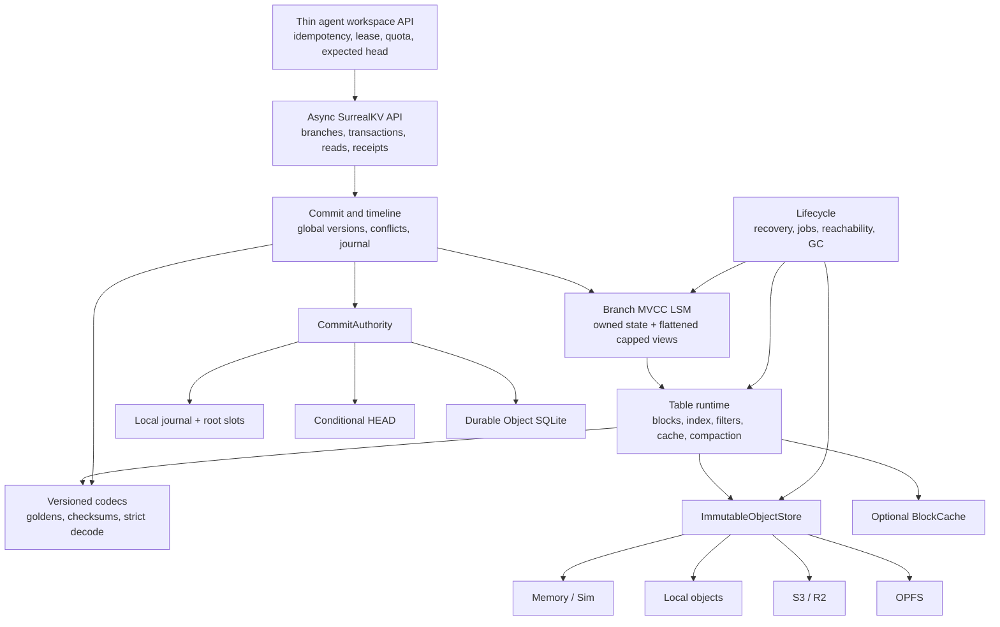
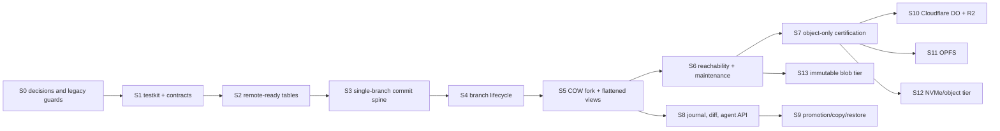

# Branch-Native SurrealKV Implementation Plan

Status: Proposed execution plan

Architecture basis:

- [BRANCHING_REWRITE_PLAN.md](BRANCHING_REWRITE_PLAN.md)
- [BRANCHING_ADVERSARIAL_REVIEW.md](BRANCHING_ADVERSARIAL_REVIEW.md)

This is a complete format and API rewrite. It does not preserve the old B+tree, VLog, checkpoint,
timestamp, WAL, or public transaction semantics. Planning labels in this document are issue/PR
metadata only; they must not appear in production type names, module names, metrics, or errors.

## 1. Deliverable

The first certified release provides one semantic branch engine with these profiles:

1. Memory: ephemeral reference behavior.
2. Local: crash-durable, single-host behavior.
3. SimStorage: deterministic fault and concurrency testing.
4. Object-only: single active writer, object-authoritative durability, remote readers within the
   certified snapshot-lifetime policy.
5. Cloudflare edge: one SQLite-backed Durable Object authority plus R2 immutable objects.
6. Browser OPFS: device-local persistence through a dedicated Web Worker.

All profiles expose the same byte-oriented behavior:

- empty branch creation and same-name generation fencing;
- current, version, and timestamp-resolved COW fork;
- latest, at-version, at-timestamp, scan, and per-key history reads;
- atomic multi-key commits with expected branch-head guards;
- branch deletion without deleting shared data;
- change journal, paginated diff, and merge-base facts;
- idempotent agent workspace creation, leases/quotas, receipts, and cleanup;
- later, conditional promotion/copy/restore over the same commit primitive.

## 2. Deliberate simplifications

These choices prevent the first implementation from repeating Strata's complexity growth.

| Area | First implementation | Deferred or rejected |
| --- | --- | --- |
| Compatibility | New API and durable format only | Old-store migration and dual read/write paths |
| Values | Inline in tables | Mutable VLog; immutable blob tier is a later slice |
| Versions | One authority-assigned global `CommitVersion` | User-assigned MVCC timestamps |
| Time | One database commit timeline | Per-branch timestamp indexes and coverage caches |
| Fork | Direct immutable table views plus one bounded fork-delta table | Full-copy fallback |
| Nested fork | Flattened direct view descriptors with a hard source budget | Recursive parent reads |
| Object writer | One renewable fenced writer session | Distributed memtables or multi-writer compaction |
| Compaction | Embedded coordinator, persisted jobs, SST-boundary resume | Distributed workers initially |
| Branch operations | Compare facts in KV; semantic merge above KV | JSON/graph/vector merge policy in SurrealKV |
| Backend abstraction | Object store, commit authority, optional block cache | Filesystem mega-trait or runtime-executor trait |
| Object authority | Unique immutable candidates plus conditional `HEAD` | Reusable sequential manifest names |
| Recovery | Root traversal | Reconstructing authority from bucket listing |

Promotion remains on the roadmap because agents need to apply successful work, but it is built only
after diff, retained merge bases, and atomic expected-head commits are proved. The first usable
branch release does not wait for promotion, Cloudflare, OPFS, blobs, or distributed compaction.

## 3. Target architecture



Only three behavior-bearing traits are planned initially:

```rust
trait ImmutableObjectStore {
    async fn read(&self, id: &ObjectId) -> Result<Bytes>;
    async fn read_range(&self, id: &ObjectId, range: ByteRange) -> Result<Bytes>;
    async fn put_unique(&self, request: PutRequest) -> Result<PutOutcome>;
    async fn metadata(&self, id: &ObjectId) -> Result<ObjectMetadata>;
    async fn list(&self, prefix: &ObjectPrefix, cursor: Option<ListCursor>) -> Result<ObjectPage>;
    async fn delete(&self, id: &ObjectId) -> Result<DeleteOutcome>;
}

trait CommitAuthority {
    async fn open_session(&self, mode: OpenMode) -> Result<AuthoritySession>;
    async fn load_root(&self, session: &AuthoritySession) -> Result<AuthorityRoot>;
    async fn publish(
        &self,
        session: &AuthoritySession,
        expected: &AuthorityFence,
        candidate: &RootCandidate,
    ) -> Result<PublishOutcome>;
    async fn renew(&self, session: &mut AuthoritySession) -> Result<()>;
}

trait BlockCache {
    async fn get(&self, key: &BlockCacheKey) -> Result<Option<Bytes>>;
    async fn insert(&self, key: BlockCacheKey, value: Bytes) -> Result<()>;
    async fn invalidate(&self, key: &BlockCacheKey) -> Result<()>;
}
```

Native and WASM executors are concrete target-specific modules, not another public trait. Test time
and scheduling are injected only through the private testkit until a second production
implementation proves a trait is needed.

### Proposed source ownership

```text
src/
  lib.rs                 public re-exports only
  api/                   public DTOs and async handles
  format/                durable codecs; no IO or policy
  storage/               object, authority, profile, capability adapters
  table/                 blocks, builders, readers, filters, cache, merge
  branch/                branch state, views, reads, fork, materialization
  commit/                version allocation, conflicts, timeline, journal
  lifecycle/             open, recovery, flush, compaction, reachability, GC
  agent/                 thin workspace conveniences; no model/provider code
  testkit/                model, SimStorage, faults, schedules, parity runners
```

The old modules remain compiled only until the new single-branch vertical spine replaces the public
entry point. That switch is the deletion condition: the old transaction/snapshot/LSM/WAL/VLog path
is then removed, not wrapped.

## 4. Durable state and branch algorithm

One immutable `DatabaseRoot` references all facts that must change atomically:

```text
database identity and format
global version and timestamp timeline head
branch catalog: BranchName/Id -> generation, birth, status, head
branch states: owned table levels + base table views + retention floor
commit/change-journal head
active checkpoints, operation pins, and maintenance job state
```

Large collections are persistent immutable subobjects so publishing a root does not rewrite the
whole catalog. `HEAD` points to the root object; it is the only mutable object in the generic object
profile.

Every physical row is ordered as:

```text
physical branch id | user key | descending global commit version | row kind
```

A `TableView` carries table ID, physical branch ID, key range, maximum visible version, and optional
minimum version. Readers normalize the physical branch prefix to the selected logical branch and
merge all sources by user key and global version. Tombstone and TTL decisions occur after the
highest visible version is selected.

### Current or historical fork

```mermaid
sequenceDiagram
    participant A as Agent/client
    participant C as Commit runtime
    participant S as Source branch state
    participant O as Immutable objects
    participant R as Database root authority

    A->>C: Fork(source, destination, selector, expected_source_head)
    C->>S: Resolve selector to fork version F
    C->>S: Capture owned tables and existing base views
    C->>S: Freeze committed unsealed rows at or below F
    opt bounded unsealed rows exist
        C->>O: Build and upload one fork-delta table
    end
    C->>C: Flatten views; cap each view at F; coalesce duplicates
    alt source budget exceeded
        C-->>A: MaterializationRequired/backpressure
    else within budget
        C->>O: Upload immutable catalog/root candidate
        C->>R: Publish if source head unchanged and destination absent
        R-->>A: Fork receipt with branch generation, head, F
    end
```

There is no full-copy fallback. Fork cost is proportional to metadata plus the bounded unsealed
delta. If `max_base_views` or `max_read_sources` would be exceeded, the operation returns a typed
retryable result and may enqueue materialization. It never surprises an agent with an O(dataset)
operation.

### Publication and maintenance states

Every multi-step operation uses durable states with one installer:

```text
Planned -> Uploading -> Uploaded -> Installed -> Reclaimable
                  \-> Failed/Quarantined
```

Flush and compaction outputs are not live at `Uploaded`. Only root installation makes them
reachable. The embedded maintenance coordinator alone transitions `Uploaded -> Installed`.
Recovery retries installed-unknown operations idempotently and preserves ambiguous objects.

## 5. Backend profiles

| Profile | Immutable objects | Authority | Initial concurrency contract |
| --- | --- | --- | --- |
| Memory | In-memory map | Mutex state | One process; concurrent tasks |
| SimStorage | Deterministic object state machine | Scripted CAS/session state | Exhaustive scheduled races/faults |
| Local | Files under canonical object layout | Framed journal, writer lock, alternating checksummed root slots | One writer process, in-process readers |
| Object-only | S3/R2 objects, optional local block cache | Conditional `HEAD` plus renewable writer session | One active writer; certified bounded remote snapshots |
| Cloudflare | R2 objects, isolate cache | One DO SQLite database | All writes routed through one DO |
| OPFS | OPFS objects, memory cache | Worker journal and dual root slots | One dedicated Web Worker/open handle |
| Server tiered | Object-authoritative tables plus NVMe cache, or explicit local-authoritative policy | Selected local/remote authority | Same as chosen authority |

The generic native adapter may use the Rust `object_store` crate, as SlateDB does. The SurrealKV
trait remains smaller so direct Cloudflare bindings and OPFS do not emulate a native provider API.

## 6. Work graph



S8 may run alongside object certification once S5 is stable. Cloudflare, OPFS, tiering, blobs, and
promotion do not block a useful Memory/Local branch release.

## 7. Slice discipline for humans and coding agents

Each implementation slice must fit one focused review, normally at most about 1,500 net lines
excluding generated goldens. Every slice has one behavior owner and a paired test slice. Its issue
must state:

1. objective and user-observable outcome;
2. files/modules owned by the slice;
3. invariants that may not change;
4. explicit non-goals;
5. predecessor slice IDs;
6. whether old code is ported, adapted, or replaced fresh;
7. focused, parity, feature, and fault commands;
8. exit evidence and the deletion condition for transitional code.

The standard execution loop is:

```mermaid
flowchart LR
    I["Read invariant card"] --> X["Inspect corresponding old/Strata/SlateDB code"]
    X --> C["Classify port, adapt, or fresh"]
    C --> T["Add failing model/conformance case"]
    T --> V["Implement one vertical behavior"]
    V --> Q["Focused tests"]
    Q --> P["Backend parity + fault tests"]
    P --> G["Source/dependency/absence guards"]
    G --> E["Record exit evidence"]
```



An agent must not silently expand a slice. It records a follow-up if it discovers a new invariant or
cross-module owner. Production code never contains slice codes.

## 8. Detailed implementation stages

### S0 — decisions, baseline, and removal guards

Implementation slices:

- `S0A`: freeze this review, root protocol, branch row model, durability vocabulary, and first
  release scope as short invariant cards.
- `S0B`: add absence guards for B+tree code/dependencies/options and for new user-assigned MVCC
  timestamps.
- `S0C`: characterize current externally useful byte-KV behavior only; explicitly mark every old
  semantic that will break.

Test slices:

- source scans for forbidden B+tree and timestamp-ordering vocabulary;
- baseline `cargo test --lib` record;
- dependency graph and supported-target record.

Exit gate: no unresolved P0 architecture question is delegated to an implementation slice. Current
baseline is recorded, and old semantics have no compatibility promise.

### S1 — skeleton, contracts, and testkit first

Implementation slices:

- `S1A`: create the proposed module ownership tree with private-by-default visibility.
- `S1B`: implement identifiers, typed errors/outcomes, capabilities, and profile validation.
- `S1C`: implement `ImmutableObjectStore` for Memory plus byte-range conformance.
- `S1D`: implement SimStorage operations, deterministic scheduler, and failure scripts.
- `S1E`: define authority/root candidate contracts without durable behavior.

Test slices:

- object-store conformance: missing reads, ranges, create collision, metadata, idempotent delete;
- capability mismatch and “fail before mutation” tests;
- feature checks for native and `wasm32-unknown-unknown` memory builds;
- testkit/source guards proving fault hooks are unavailable in ordinary builds.

Exit gate: Memory and SimStorage pass the same object contract; no branch/table/WAL behavior has
leaked into storage adapters.

### S2 — remote-ready immutable table format

Implementation slices:

- `S2A`: physical key/row codecs and strict decode limits.
- `S2B`: independently checksummed data blocks with compression abstraction.
- `S2C`: index, filter, properties, and fixed trailer/footer locating every section.
- `S2D`: streaming table builder that determines object ID before publication or uses a unique
  upload ID plus mandatory final digest.
- `S2E`: range reader with coalescing, prefetch budget, single-flight point blocks, and cache tags.

Test slices:

- golden byte vectors and cross-version refusal;
- corruption at header, index, filter, block, trailer, length, and checksum boundaries;
- property comparison against a sorted in-memory row model;
- full-object-forbidden tests proving point reads use bounded ranges;
- cache corruption eviction/refetch and concurrent loader collapse.

Exit gate: the same reader consumes tables from Memory, SimStorage, and a local object adapter using
only ranges. No table operation assumes rename, append, mmap, or whole-table buffering.

### S3 — single-branch commit vertical spine

Implementation slices:

- `S3A`: mutable/frozen tables and immutable read views.
- `S3B`: Memory authority, `DatabaseRoot`, and one global version per transaction.
- `S3C`: conflict keys, expected-head guard, tombstone, TTL, latest/at-version/history reads.
- `S3D`: database commit timeline and timestamp-to-version resolution.
- `S3E`: Local object adapter, framed commit journal, writer lock, root slots, and recovery.
- `S3F`: switch `lib.rs` to the new API and remove the old transaction/snapshot/LSM/WAL/VLog path.

Test slices:

- state-machine comparison of commit/read/abort/conflict operations;
- every journal frame and root-slot tear point;
- fsync/publish failure classification and unknown visibility;
- close/reopen parity between Memory model and Local;
- public API/source guard proving only the new path is reachable.

Exit gate: one branch is a complete crash-durable KV engine on Local. The old runtime is deleted,
there is one MVCC order, and all 1.x files are rejected by format identity.

### S4 — branch catalog and lifecycle

Implementation slices:

- `S4A`: branch IDs, validated names, catalog record, hidden system branch, default branch bootstrap.
- `S4B`: empty create/get/list/exists with idempotency key.
- `S4C`: branch-aware transactions and physical key routing.
- `S4D`: deleting/deleted states, generation increment, same-name recreation, protected branches.

Test slices:

- branch isolation across point/range/reverse/history reads;
- concurrent create/delete/recreate schedules;
- stale generation transaction and replay rejection;
- crash at each lifecycle record/root publication point.

Exit gate: lifecycle operations are atomic root commits and stale work cannot mutate a recreated
branch.

### S5 — COW fork and bounded inherited reads

Implementation slices:

- `S5A`: `TableView`, physical-to-logical key normalization, multi-source merge cursor.
- `S5B`: current fork with bounded fork-delta table and expected source-head guard.
- `S5C`: historical fork at explicit retained version.
- `S5D`: timestamp fork through the global timeline only.
- `S5E`: flattened fork-of-fork descriptors, duplicate coalescing, source/read budgets.
- `S5F`: explicit materialization-required outcome and materialization install state.

Test slices:

- child isolation from post-fork parent writes;
- child tombstones/TTL shadowing across all iterator directions;
- historical child equals a full source scan at exactly `F`;
- fork-of-fork without parent liveness dependency;
- constant metadata work plus bounded unsealed bytes; test forbids full source scan/copy;
- budget exceed returns before visible destination creation.

Exit gate: no fork shape has an implicit O(dataset) fallback. A child root directly identifies all
objects needed to recover it after its ancestors are deleted.

### S6 — flush, compaction, reachability, and recovery

Implementation slices:

- `S6A`: durable flush jobs with pinned frozen input and `Uploaded/Installed` distinction.
- `S6B`: branch-owned compaction; inherited bases remain immutable.
- `S6C`: persisted compaction job IDs, fencing epoch, output list, and SST-boundary resume.
- `S6D`: database-wide root traversal and reachability report.
- `S6E`: checkpoints, reader/operation pins, quarantine epoch, and delete executor.
- `S6F`: branch materialization and release of base views.

Test slices:

- compaction output equivalence to the uncompacted model;
- coordinator restart at every job state and output boundary;
- branch delete/materialize/compact races;
- no deletion while referenced by root, checkpoint, reader, operation, or quarantine;
- corrupt/incomplete reachability fails closed and leaks space;
- long snapshot versus GC schedules.

Exit gate: GC is a pure consequence of authoritative roots and pins. Object age or listing never
proves deadness.

### S7 — object-only authority and certification

Implementation slices:

- `S7A`: native S3-family adapter, request identity, tagged instrumentation, bounded retry.
- `S7B`: unique immutable commit/root objects and bootstrap-only `HEAD` create.
- `S7C`: conditional `HEAD` update, parent-lineage reconciliation, and lost-response handling.
- `S7D`: renewable single-writer session and explicit snapshot lifetime/reader lease policy. The
  writer epoch lives in `HEAD`: takeover conditionally advances that epoch even when the root ID is
  unchanged, and every commit compares both the opaque `HEAD` fence and session epoch. A stale
  session therefore cannot publish after takeover. Automatic expiry/takeover is enabled only when
  the adapter has a proved time source; otherwise takeover is an explicit administrative action.
- `S7E`: streaming multipart table/compaction upload with unique keys and reconciliation.
- `S7F`: orphan inventory, operation pins, cost metrics, and object-aware maintenance budgets.

Test slices:

- MinIO/provider conformance plus real S3/R2 smoke where credentials exist;
- timeout before/after object put, multipart completion, and `HEAD` CAS;
- stale writer resume, lease loss, CAS race, corrupt cache, truncated range body;
- bucket listing omission/duplication/reordering cannot change recovered state;
- request/byte/orphan budgets for point, scan, fork, commit, compaction, and reopen;
- full Memory/Local/Object semantic parity suite.

Exit gate: the object profile is enabled only for a capability set that passes the full proof. A
provider lacking conditional update is rejected before mutation; no sequenced-manifest fallback is
silently selected.

### S8 — change journal, diff, and thin agent workspace API

Implementation slices:

- `S8A`: commit DAG record and changed-key journal in the same root commit as data.
- `S8B`: merge-base facts and paginated two-/three-way byte-level diff.
- `S8C`: leases, quota counters, provenance, idempotency, expected-head workflow, read-only evaluation.
- `S8D`: bulk create/evaluate/expire calls with bounded concurrency and backpressure.
- `S8E`: machine-readable capability/error catalog generated from public enums.

Test slices:

- journal diff equals full-scan oracle under generated branch histories;
- missing retained base fails explicitly;
- idempotent retries return the original branch/commit receipt;
- expiry cannot race an active transaction or snapshot;
- wide fan-out and deep-search workload budgets.

Exit gate: an agent can cheaply create an isolated workspace, mutate, inspect a bounded diff, and
discard it without using storage internals. SurrealKV contains no MCP, prompt, or model-provider
code.

### S9 — promotion, selective copy, and restore

Implementation slices:

- `S9A`: fast-forward promotion with expected target head.
- `S9B`: strict three-way byte conflict facts; no product-aware auto-resolution.
- `S9C`: selected current-value copy and selected journal-change apply as distinct APIs.
- `S9D`: compensating restore commit; old commits remain immutable.

Test slices:

- promotion is one target commit or no change;
- source branch is unchanged;
- conflict report contains base/source/target values and versions;
- crash/unknown outcome never exposes half an application;
- higher-layer merge callback is invoked only after storage conflict facts are complete.

Exit gate: byte-level operations are correct and atomic. SurrealDB, not SurrealKV, owns record/index/
graph semantic merging.

### S10 — Cloudflare Durable Object plus R2

Implementation slices:

- `S10A`: direct R2 binding adapter and Worker-compatible async build.
- `S10B`: SQLite authority schema for root, branch catalog, commit rows, sessions, and intents.
- `S10C`: R2 flush/compaction intent state machine and recovery.
- `S10D`: alarm/queue-driven bounded maintenance, streaming reads, subrequest budgets.
- `S10E`: TypeScript/WASM binding and deployment diagnostics.

Test slices:

- workerd/miniflare parity tests plus deployed smoke;
- failure at intent creation, upload, verification, install, and cleanup;
- isolate memory, CPU, subrequest, SQLite bytes, and alarm-step budgets;
- one-DO commit throughput and wide-agent-fan-out envelope.

Exit gate: SQLite is the acknowledged authority and R2 installation is recoverable. The system
never claims an atomic SQLite+R2 transaction.

### S11 — browser OPFS

Implementation slices:

- `S11A`: dedicated Web Worker runtime and sync access-handle object adapter.
- `S11B`: OPFS framed journal, exclusive open, flush, and dual root slots.
- `S11C`: quota/persistence/eviction diagnostics and typed errors.

Test slices:

- Chromium/Firefox/WebKit write-close-reopen;
- partial journal, torn slot, quota, exclusive-open, clearing, and eviction classification;
- browser parity suite with no IndexedDB fallback.

Exit gate: OPFS is honestly classified as device-local best-effort persistence.

### S12 — server NVMe plus object cold tier

Implementation slices:

- `S12A`: verified object-location registry and relocation intents.
- `S12B`: object-authoritative mode with disposable NVMe cache.
- `S12C`: explicit local-authoritative mode with cold archive watermark.
- `S12D`: native read-ahead/io_uring optimizations contained inside the local adapter.

Test slices:

- crash at each relocation transition leaves a verified reachable copy;
- cache corruption/miss rehydrates from authority;
- inherited branch and reader pins block unsafe location removal;
- warm/cold performance and request budgets.

Exit gate: every configuration reports exactly one durability authority. Archive is not described as
failover until its committed watermark proves it.

### S13 — optional immutable blob tier

Implementation slices:

- content-addressed immutable blob format and row reference;
- streaming write/read and inline threshold;
- all-root reachability, reader pins, and quarantine deletion.

Exit gate: inline and blob results are byte-identical, and every fork/compaction/delete/recovery
fault leaks space rather than producing a dangling blob reference.

## 9. Cross-cutting verification matrix

Every completed stage runs the applicable rows below on every certified profile.

| Dimension | Required cases |
| --- | --- |
| Semantics | point, range, reverse, history, tombstone, TTL, conflict, fork cap |
| Lifecycle | empty/create/fork/delete/recreate, protected branch, idempotency |
| Concurrency | readers versus rotate/install/materialize/delete; writers versus expected head |
| Crash | before/after durable dependency, root publication, visibility, cleanup |
| Object faults | lost response, partial body, stale cache/list, precondition, quota, corruption |
| Retention | descendant, checkpoint, reader, operation, lease, quarantine, missing facts |
| Targets | native default, no-default/WASM memory, local feature, testkit/fault feature |
| Economics | requests, bytes, amplification, orphan growth, cache hit rate, fork latency |

The reference model stores logical branch histories as maps and applies operations without an LSM.
Generated scripts run against the model and each backend. Any backend-specific normalization is
limited to durability/diagnostic facts; returned keys, values, versions, branch heads, and conflicts
must match.

## 10. Release gates

### Core branch release

Requires S0-S6:

- Memory, Local, and SimStorage parity is green;
- B+tree and old runtime paths are absent;
- current/historical/nested fork never performs an unannounced full copy;
- recovery and GC fail closed;
- local crash matrix passes.

### Object release

Adds S7:

- provider capability probe and conformance are green;
- unknown outcomes and stale writer schedules are proven;
- request/cost limits are published;
- one-writer and snapshot-lifetime limitations are explicit.

### Agent workflow release

Adds S8, with S9 optional:

- workspaces are idempotent, leased/quota-bounded, comparable, and cheaply disposable;
- stable receipts/errors/capabilities are machine-readable;
- promotion is absent until S9's atomic/conflict gates pass.

### Edge/browser/server releases

S10-S12 are independently certified profiles. Compiling the adapter or passing the core semantic
suite is necessary but not sufficient; each profile must pass its platform crash/fault and resource
budgets before documentation calls it durable.
